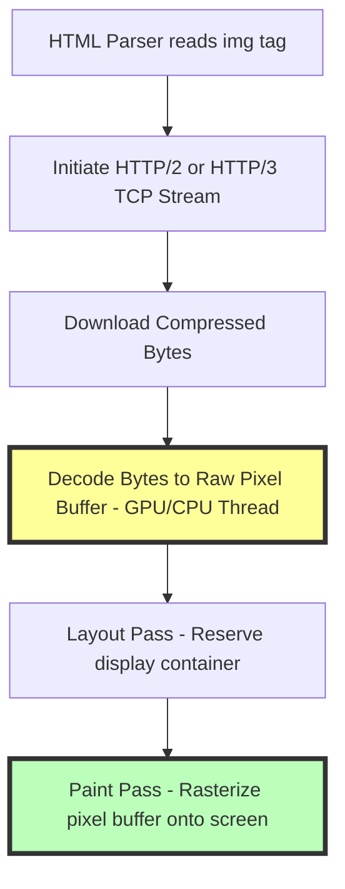

# How to Make Images Load Faster: Technical Web Optimization Guide

Page speed is a critical factor in user experience and SEO. In modern web architectures, image assets account for over **60%** of the byte weight transferred during page loads. Heavy, unoptimized images slow down rendering, delay key performance milestones, and trigger layout shifts that frustrate users.

To optimize page speed, you must understand how browsers process, decode, and render visual content. By combining optimized image sizes with performance attributes, stylesheet layouts, and CDN caching, you can improve page load speeds and boost your Core Web Vitals scores.

This guide analyzes the browser rendering pipeline, outlines performance attributes for HTML image tags, details layout optimization techniques, and provides step-by-step export settings.

---

## The Browser Rendering & Decoding Pipeline

To speed up image rendering, you must first understand how web browsers process image files after downloading them from a server:



When a browser processes an image, it runs through several distinct execution phases:
1.  **Network Stream Acquisition:** The browser reads the image URL and downloads the compressed bytes via HTTP/2 or HTTP/3 multiplexed streams.
2.  **Image Decoding (The Bottleneck):** The compressed binary data (e.g. JPG or PNG) is decoded into a raw, uncompressed pixel buffer in memory. This decoding process is CPU-intensive and runs on the browser's main thread by default, which can block user interactions.
3.  **Layout Pass (Reflow):** The browser calculates the display dimensions of the image container to position it within the page layout.
4.  **Paint Pass (Repaint):** The browser rasterizes the pixel buffer onto the screen.

Optimizing file sizes reduces download latency, while using native layout boundaries and asynchronous decoding prevents layout shifts and keeps the browser interface responsive.

---

## HTML Performance Optimization Attributes

Modern HTML5 elements provide several attributes to help you control how and when images are downloaded and rendered:

### 1. Native Lazy Loading (`loading="lazy"`)
The `loading="lazy"` attribute instructs the browser to defer downloading images located below the fold until the user scrolls near them:
```html

```
Deferring below-the-fold images reduces the initial page weight, allowing critical above-the-fold content to load much faster.

### 2. Asynchronous Decoding (`decoding="async"`)
The `decoding="async"` attribute allows the browser to decode image bytes on a separate background thread:
```html

```
Decoding images asynchronously prevents the main thread from blocking, ensuring page scrolling and button clicks remain responsive while images render.

### 3. Priority Hints (`fetchpriority="high"`)
Use the `fetchpriority="high"` attribute on your website's Largest Contentful Paint (LCP) element—usually the main hero banner or product image—to instruct the browser to download it immediately:
```html

```
Setting a high fetch priority tells the browser to download the hero banner ahead of other assets, improving your LCP score.

---

## CSS Layout and Placeholder Techniques

Unoptimized images can cause the page layout to shift as they load, creating a poor user experience. You can prevent layout shifts and improve perceived load speeds using CSS placeholder techniques:

### 1. Reserving Space with aspect-ratio
Define the aspect ratio of your image containers in your CSS styles. This reserves the required layout space before the image loads, preventing Cumulative Layout Shift (CLS):
```css
.hero-image {
  aspect-ratio: 16 / 9;
  width: 100%;
  height: auto;
  background-color: #e0e0e0; /* Gray placeholder block */
}
```

### 2. Progressive Placeholders (Blur-Up Technique)
For large hero banners, display a low-resolution, highly compressed placeholder image scaled up to fill the container, then swap it for the high-resolution original once it finishes downloading:
```html
<div class="blur-up-container" style="background-image: url('hero-tiny.jpg');">
  
</div>
```
This technique provides a smooth transition as the high-resolution image loads, keeping the page layout stable.

---

## CDN Caching and Delivery Optimizations

Serving images from a global Content Delivery Network (CDN) reduces physical distance latency between your server and users:

*   **Cache-Control Headers:** Configure your server or CDN to send aggressive caching headers for static image assets:
    ```http
    Cache-Control: public, max-age=31536000, immutable
    ```
    This instructs the user's browser to store the image locally in its cache for up to a year, preventing redundant network requests on subsequent visits.
*   **Dynamic Format Transcoding:** Use CDN features to automatically convert JPEGs and PNGs to WebP or AVIF formats based on browser support, reducing file sizes without sacrificing quality.

---

## HTTP/2 Multiplexing and HTTP/3 QUIC Network Streams

Modern network protocols have significantly improved how browsers request and download image assets:
*   **HTTP/2 Multiplexing:** Unlike HTTP/1.1 (which limited browsers to six concurrent connections per domain), HTTP/2 allows the browser to request multiple images concurrently over a single TCP connection. This reduces connection overhead and speeds up load times for image-heavy pages.
*   **HTTP/3 QUIC Streams:** HTTP/3 replaces TCP with the UDP-based QUIC protocol, which resolves head-of-line blocking. If a packet is lost during download, only the stream containing that packet is delayed, allowing other images to finish downloading without interruption.

---

## CSS Content-Visibility and Off-Screen Rendering

To reduce CPU rendering times on image-heavy pages (like galleries or collection grids), use the CSS `content-visibility` property:
*   **The Auto Attribute:** Applying `content-visibility: auto` to off-screen image containers tells the browser to skip layout and rendering calculations for those containers until they approach the viewport:
    ```css
    .image-grid-item {
      content-visibility: auto;
      contain-intrinsic-size: 300px 200px; /* Define placeholder dimensions */
    }
    ```
*   **Performance Impact:** Skipping calculations for off-screen containers reduces the initial CPU load, allowing the browser to render the visible portion of the page much faster.

---

## Step-by-Step Performance Checklist

To optimize your images for maximum loading speed, run your assets through this checklist:

*   **Format:** Convert images to next-generation formats like **WebP** or **AVIF** to reduce file sizes.
*   **Dimensions:** Resize images to their exact display dimensions to prevent unnecessary data transfer.
*   **Layout:** Define explicit aspect ratios for your image containers using CSS to prevent layout shifts (CLS).
*   **Lazy Loading:** Apply `loading="lazy"` and `decoding="async"` to all images located below the fold.
*   **Fetch Priority:** Set `fetchpriority="high"` for above-the-fold hero banners and LCP elements.
*   **Caching:** Configure your server or CDN to send aggressive `Cache-Control` headers for static assets.

---

## Frequently Asked Questions

### What is the best way to speed up image load times?
The best way is to resize images to their display dimensions, compress them using next-generation formats (like WebP or AVIF), and apply native lazy loading (`loading="lazy"`) to below-the-fold assets.

### How does lazy loading improve page speed?
Lazy loading defers downloading images located below the fold until the user scrolls near them. This reduces the initial page weight and server requests, allowing critical above-the-fold content to load much faster. By prioritizing the download of above-the-fold assets, the browser can complete the critical rendering path sooner, improving core speed metrics like Time to Interactive (TTI) and First Contentful Paint (FCP). Modern browsers calculate viewport proximity thresholds dynamically based on connection speeds, ensuring images finish downloading before they enter the user's screen.

### What is the difference between synchronous and asynchronous image decoding?
Synchronous decoding decodes image data on the browser's main thread, which can block user interactions and cause scrolling lag. Asynchronous decoding offloads this processing to a background thread, keeping the main thread responsive.

### Should I apply lazy loading to my homepage hero banner?
No. Never lazy-load your Largest Contentful Paint (LCP) element, such as your main hero banner. Lazy-loading above-the-fold images delays their rendering, hurting your LCP score. Instead, set their fetch priority to high: `fetchpriority="high"`. This instructs the browser's preload scanner to schedule the image download ahead of other non-critical assets (like stylesheets or scripts), ensuring the main visual content renders within the first **2.5 seconds** of the page load.

### Why does my layout shift when images load?
Layout shifts occur when image dimensions are not declared in the HTML or CSS. Without these dimensions, the browser cannot reserve the required layout space before the image loads, causing page content to shift down once the file finishes downloading. This instability hurts your Cumulative Layout Shift (CLS) score, which can negatively impact SEO rankings. Setting explicit width and height attributes allows the browser to reserve the exact layout slot beforehand, keeping the page layout stable.

### How can I compress my web images securely?
To compress your images without exposing assets to external databases, use our free, browser-based [Image Compressor](/tools/image-compressor). The tool runs locally in your browser, keeping your files private and secure. All processing operations are executed in your browser's sandbox using local CPU cores, ensuring client designs, mockups, or sensitive document scans are never transmitted over the network or stored on third-party cloud servers.