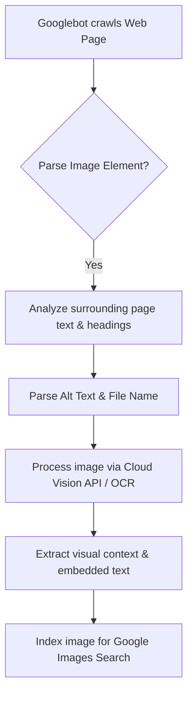

# How to Optimize Images for SEO: The Complete Technical Guide

Search engine optimization (SEO) is a fundamental pillar of digital marketing, driving organic traffic and brand visibility. While many SEO strategies focus on keyword research and text optimization, image optimization is also critical for ranking in Google Images and standard web results.

Google's search engine processes billions of image queries daily. To rank in these searches, you must structure your image assets so Google's crawlers can index and understand them effectively. Additionally, unoptimized images slow down page load speeds, hurting your Core Web Vitals and lowering your standard search rankings.

This guide analyzes how search engines process images, outlines optimization best practices for alt text and file names, and details sitemap and schema configurations to maximize your visibility in search results.

---

## How Google's Search Engine Processes Images

To optimize images for SEO, you must understand how Google's crawlers (Googlebot) analyze and index visual content:



Googlebot uses a multi-faceted analysis pipeline to index images:
1.  **Semantic Context Analysis:** Googlebot reads the page text immediately surrounding the image, as well as the page headings and title, to determine the image's context.
2.  **Metadata Extraction:** The crawler reads the `alt` text attribute, file name, and image caption to extract explicit descriptions.
3.  **Computer Vision (Cloud Vision API):** Google runs images through computer vision models to identify objects, landmarks, faces, and text (OCR). 

Optimizing all of these metadata signals helps Google accurately catalog your images and display them for relevant search queries.

---

## Descriptive File Naming Conventions

The first step in image SEO optimization begins before uploading: naming your image file. Avoid generic file names generated by cameras or stock photo sites (such as `DSC_4812.jpg` or `shutterstock_928374.jpg`).

*   **Use Hyphens, Not Underscores:** Google's search algorithms treat hyphens (`-`) as word separators, while underscores (`_`) are treated as word joiners. Naming a file `red-leather-office-chair.jpg` allows Google to read it as "red leather office chair", whereas `red_leather_office_chair.jpg` is read as a single word.
*   **Write Descriptive, Keyword-Rich Names:** Describe the image content clearly and concisely, incorporating target keywords naturally:
    *   *Unoptimized:* `banner-final-version-2.jpg`
    *   *Optimized:* `how-to-compress-images-without-losing-quality-banner.jpg`

---

## Writing Semantic Alt Text

The `alt` (alternative text) attribute is the most important image metadata tag for SEO. It is read by search engine crawlers to understand image content and by screen readers to describe images for visually impaired users.

### Guidelines for Writing Effective Alt Text:
*   **Be Descriptive and Specific:** Describe the subject matter, colors, and layout of the image clearly.
*   **Incorporate Keywords Naturally:** Add relevant search queries where they fit naturally, avoiding keyword stuffing.
*   **Keep it Under 125 Characters:** Most screen readers truncate alt text after 125 characters, so keep descriptions concise.
*   **Avoid Redundant Phrases:** Do not begin alt text with "image of..." or "graphic of...", as search engines already know it is an image.

### Alt Text Examples:
*   *Bad (Keyword Stuffing):* ``
*   *Okay (Generic):* ``
*   *Optimized (Semantic):* ``

---

## XML Image Sitemaps

To ensure Google's crawlers can find and index all the images on your website, you should list your image URLs in a dedicated **XML Image Sitemap**:

*   **Image Sitemap Syntax:** An image sitemap uses special XML tags to declare image locations, captions, titles, and license URLs within your standard sitemap structure:
    ```xml
    <?xml version="1.0" encoding="UTF-8"?>
    <urlset xmlns="http://www.sitemaps.org/schemas/sitemap/0.9"
            xmlns:image="http://www.google.com/schemas/sitemap-image/1.1">
      <url>
        <loc>https://imagetoolstack.com/articles/image-optimization</loc>
        <image:image>
          <image:loc>https://imagetoolstack.com/images/seo-workflow.jpg</image:loc>
          <image:title>Image SEO Workflow Diagram</image:title>
          <image:caption>Visual flowchart explaining how Googlebot crawls and processes web images.</image:caption>
        </image:image>
      </url>
    </urlset>
    ```
*   **Indexing Benefit:** Including your image URLs in an XML sitemap helps Google discover dynamically loaded images or assets hidden inside JavaScript tabs, ensuring they are crawled and indexed.

---

## Structured JSON-LD Schema Markup

Using structured data schema (JSON-LD) on your pages helps Google understand the relationships between your text content and your image assets:

*   **Product Schema:** Product pages should include schema that links product details directly to the featured image URL:
    ```json
    {
      "@context": "https://schema.org/",
      "@type": "Product",
      "name": "Professional Photo Editing Software",
      "image": [
        "https://imagetoolstack.com/images/software-box.jpg"
      ],
      "description": "High-performance editing software with advanced upscaling algorithms."
    }
    ```
*   **Article Schema:** Blog posts and informational guides should declare the main cover image URL in an Article schema block:
    ```json
    {
      "@context": "https://schema.org",
      "@type": "NewsArticle",
      "headline": "How to Optimize Images for SEO",
      "image": [
        "https://imagetoolstack.com/images/seo-guide-cover.jpg"
      ],
      "datePublished": "2026-07-21T17:50:00.000Z"
    }
    ```

---

## Google Cloud Vision API Labels & Web Entities

To categorize images, Google's algorithms analyze pixel patterns using their **Cloud Vision API**:
*   **Label Detection:** The system assigns label coordinates with confidence scores (e.g. "laptop: 98%", "keyboard: 95%"), identifying objects, colors, and layouts.
*   **Web Entities:** The algorithm searches for the image across the web to identify related "Web Entities"—semantic associations and terms found on other pages. Aligning your surrounding text with these Web Entities helps Google understand the topic of your page, improving your search relevance.

---

## Lazy Loading SEO Gotchas & Crawling Rules

Implementing lazy loading is essential for page speed, but improper setup can block search engines from crawling your images:
*   **Native Lazy Loading:** Use native browser lazy loading (`loading="lazy"`). Search engines fully support this attribute and will crawl the images correctly.
*   **Legacy JavaScript Plugins:** Avoid using legacy JavaScript lazy-load libraries that store image URLs in custom attributes (like `data-src`) and swap them to the `src` attribute as the user scrolls. If Googlebot crawls the page without executing the JavaScript, it will see a broken or blank image, preventing the file from being indexed.

---

## Step-by-Step Image SEO Checklist

Before publishing new content or layouts, run your image assets through this SEO checklist:

*   **File Name:** Name the file descriptively using lowercase letters and hyphens to separate words.
*   **Alt Text:** Write a descriptive, keyword-rich alt attribute for every image.
*   **Format:** Deliver images in modern web formats like **WebP** or **AVIF** to reduce file sizes and improve page load speeds.
*   **Dimensions:** Resize images to their exact display dimensions to prevent layout shifts (CLS) and keep the Largest Contentful Paint (LCP) fast.
*   **Sitemap:** List all key image URLs in your website's XML sitemap.
*   **Schema:** Implement JSON-LD schema to define the relationship between your page content and your image assets.

---

## Frequently Asked Questions

### What is the best image format for SEO?
The best formats are **WebP** and **AVIF**. These next-generation formats offer better compression than JPEGs and PNGs, reducing file sizes and improving page load speeds, which is a direct ranking factor for Google.

### Why is alt text important for SEO?
Alt text is read by search engine crawlers to understand the context and subject matter of an image, helping the page rank in relevant search results. Additionally, alt text is essential for web accessibility under WCAG compliance guidelines, allowing screen readers to describe images for visually impaired users. If an image fails to load due to network issues, the browser displays the alt text instead, preventing a broken user experience.

### Should I use hyphens or underscores in image file names?
Always use **hyphens** (`-`). Google's search algorithms treat hyphens as spaces (separating words), while underscores (`_`) are treated as word joiners (merging words into a single term).

### How does image compression affect SEO?
Image compression reduces file sizes, which improves page load speeds. Faster page load speeds help you achieve higher scores in Google's Core Web Vitals (specifically Largest Contentful Paint), which is a direct ranking factor. Additionally, lighter files reduce your server's bandwidth consumption, allowing search engine crawlers to index more pages within their crawl budget.

### Can Google read text inside an image?
Yes. Google's search engine uses Optical Character Recognition (OCR) to extract text embedded in images. However, to ensure search engines can index your text content reliably, you should write it as actual HTML text rather than embedding it inside image files. Placing critical marketing copy or titles inside flattened JPEGs prevents search bots from scanning the text for keyword matches and makes the content inaccessible to screen readers.

### How can I inspect my image's metadata securely?
To view EXIF parameters, location coordinates, and embedded color profiles without exposing your files to third-party databases, use our free, browser-based [Metadata Viewer](/tools/metadata-viewer). The tool runs locally in your browser, keeping your files private and secure. Stripping private metadata (like GPS coordinates) before publishing protects user privacy while reducing file sizes.