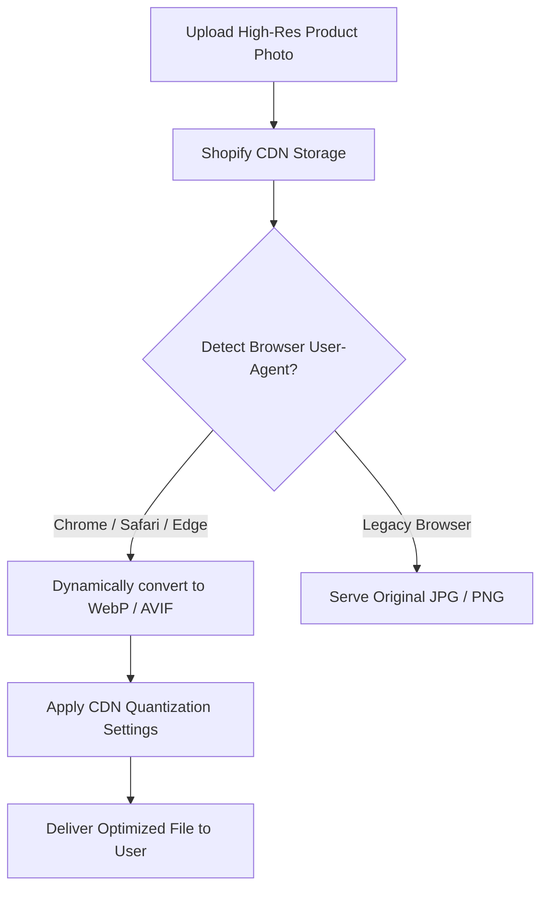

# How to Optimize Images for Shopify: Speed & Conversion Guide

In the highly competitive e-commerce sector, website performance directly impacts conversion rates and revenue. High-quality product photography is essential for building consumer trust and showcasing product details. However, unoptimized image files are the primary cause of slow page load speeds on Shopify stores.

Google's search algorithm uses Core Web Vitals—specifically Largest Contentful Paint (LCP)—as a direct ranking factor. A slow-loading hero banner or product image grid can lower your SEO visibility and increase bounce rates, particularly on mobile connections.

This guide explains how Shopify's Content Delivery Network (CDN) handles image assets, outlines responsive design settings, and details how to optimize your store's image assets to maximize performance and conversion rates.

---

## How Shopify's CDN Processes Images

When you upload an image to your Shopify admin panel, the file is stored on Shopify's global, Cloudflare-powered Content Delivery Network (CDN). 



Shopify's CDN performs several automated transformations during asset delivery:
*   **Dynamic Format Conversion:** The CDN analyzes the user-agent header of the incoming request. If the subscriber's browser supports modern formats, Shopify automatically converts JPEGs and PNGs to **WebP** or **AVIF** dynamically.
*   **CDN Lossy Re-compression:** The CDN applies standard lossy compression settings to the converted files. However, if you upload a bloated, uncompressed $5\text{MB}$ file, Shopify's automated compression will often result in a file that is still too large for fast mobile rendering.
*   **Preventing Double-Compression:** Pre-compressing your images locally to under **100KB** before upload ensures they bypass aggressive CDN compression, preventing quality loss and keeping load times fast.

---

## Recommended Shopify Image Dimensions

To prevent layout distortion and ensure clean image scaling, structure your catalog using these standardized dimensions:

### 1. Product Listing Images (1:1 Aspect Ratio)
*   **Optimal Dimensions:** $2048\times2048$ pixels
*   **Purpose:** The standard format for product listing pages and product detail grids. Exporting at $2048\times2048$ pixels provides enough resolution to enable Shopify's hover-to-zoom feature without pixelation, while keeping the file footprint small.

### 2. Collection Hero Banners (16:9 Aspect Ratio)
*   **Optimal Dimensions:** $1920\times1080$ pixels (Desktop) and $800\times800$ pixels (Mobile)
*   **Purpose:** Large banners displayed at the top of collection pages. Use responsive Liquid theme settings to load separate desktop and mobile banner crops, preventing layout distortion.

### 3. Slideshow Banners (Widescreen)
*   **Optimal Dimensions:** $1600\times900$ pixels
*   **Purpose:** Rotating slideshow banners on the store homepage. Keep text minimal and compress these assets aggressively to avoid hurting your LCP score.

---

## Core Web Vitals & Theme Layout Optimization

Optimizing the code in your Shopify theme is just as important as optimizing your image files. Unoptimized theme templates can cause layout shifts and slow down page rendering.

### 1. Implementing Responsive Image Markup (srcset)
Avoid loading large desktop images on mobile screens. Edit your theme's Liquid template files (such as `product-template.liquid` or `product-card.liquid`) to use the `srcset` attribute, allowing the browser to load the optimal image size based on the user's screen width:
```liquid

```

### 2. Loading Priorities: Lazy Loading vs. Fetch Priority
*   **Below-the-Fold Images:** Apply the `loading="lazy"` attribute to all images located below the fold (such as product grids, reviews, and footer logos) to prevent them from loading until the user scrolls to them.
*   **Above-the-Fold Images:** Never lazy-load your main product image or homepage hero banner. Doing so will delay the Largest Contentful Paint (LCP) and hurt your SEO score. Instead, set the fetch priority to high:
    ```html
    
    ```

### 3. Reducing Cumulative Layout Shift (CLS)
Always define explicit aspect ratios for your image containers using CSS. This reserves the required layout space before the image loads, preventing the page layout from shifting and keeping your CLS score low:
```css
.product-image-container {
  aspect-ratio: 1 / 1;
  background-color: #f5f5f5;
  width: 100%;
}
```

---

## Structured SEO Metadata & Alt-Text Best Practices

Search engines cannot read image content directly, so they rely on metadata to index product images for Google Image Search:

*   **Semantic Alt Text:** Write descriptive alt text that explains the product's appearance and features:
    *   *Unoptimized:* `shoe-red-version.jpg`
    *   *Optimized:* `Men's red running shoe with white rubber sole and reflective laces`
*   **JSON-LD Schema Markup:** Verify that your theme includes structured JSON-LD schema on product pages. The schema should link your product details directly to the featured image URL, enabling Google to display product rich snippets in search results:
    ```json
    {
      "@context": "https://schema.org/",
      "@type": "Product",
      "name": "Men's Red Running Shoe",
      "image": [
        "https://cdn.shopify.com/s/files/1/0000/0000/files/red-running-shoe.jpg"
      ],
      "description": "High-performance running shoe with breathable mesh upper."
    }
    ```

---

## Liquid Image Tag Performance Filters

When editing Shopify themes, you should use Shopify's built-in Liquid image filters to optimize delivery:
*   **The image_url Filter:** Use the `image_url` filter (which replaced the legacy `img_url` filter) to request specific dimensions and formats directly from the CDN:
    ```liquid
    {{ product.featured_image | image_url: width: 800, format: 'pjpg' }}
    ```
    Requesting `format: 'pjpg'` instructs the CDN to serve progressive JPEGs, which render progressively as they download. This improves perceived load speeds compared to baseline JPEGs.
*   **Responsive Width Lists:** Combine the `image_url` filter with a loop of sizes to build a responsive `srcset` attribute. This allows the browser to select the optimal image width based on the user's viewport, reducing data transfer for mobile users.

---

## Shopify CSS Breakpoints and Layout Media Queries

To display banner images correctly, configure your CSS stylesheets to adapt layout sizes across devices:
*   **The Screen Breakpoints:** Set explicit breakpoints for mobile (320px to 480px), tablet (768px to 1024px), and desktop viewports (1200px and up).
*   **Mobile Image Swapping:** Use CSS media queries or the HTML `<picture>` element to swap wide desktop banners for square or portrait crops on mobile screens. This ensures product details and marketing text remain legible without stretching or pixelation.

---

## Step-by-Step Shopify Image Optimization Checklist

Before importing new products or launching campaigns, run your assets through this checklist:

*   **Format:** Export product photographs as **sRGB JPEGs** (quality 80-85%). Export transparent graphics and icons as **PNGs** or **SVGs**.
*   **Dimensions:** Resize product photos to exactly **$2048\times2048$ pixels** to support hover-to-zoom without pixelation.
*   **File Size:** Keep product image files **under 100KB** and homepage hero banners **under 300KB**. Use our [Image Compressor](/tools/image-compressor) to reduce file sizes locally before uploading.
*   **Alt Text:** Write descriptive, keyword-rich alt text for every product image in your admin panel. Avoid keyword stuffing (e.g. "shoes buy shoes cheap shoe") and instead focus on natural descriptions that assist screen readers and help search engines index your products for Google Image Search.
*   **Theme Loading Priorities:** Verify that `loading="lazy"` is applied to below-the-fold assets, and `fetchpriority="high"` is set for above-the-fold banners.

---

## Frequently Asked Questions

### What is the best image format for Shopify?
The best format is **sRGB JPG** for product photos and **sRGB PNG** or **SVG** for logos and graphic elements. While Shopify automatically converts JPEGs to WebP and AVIF for compatible browsers, uploading clean JPEGs ensures compatibility fallbacks for older devices.

### What resolution should my Shopify product images be?
We recommend using **$2048\times2048$ pixels** (1:1 aspect ratio). This resolution provides sufficient detail to support Shopify's image zoom feature while keeping the file footprint small. For simpler grid items, you can use smaller resolutions like $1024\times1024$ pixels to save page weight.

### Why is my Shopify store loading slowly?
Slow load times are often caused by uncompressed images. Uploading large files (such as raw $5\text{MB}$ photos directly from a camera) slows down page rendering, especially on mobile networks. Always resize and compress your images before uploading them.

### Does Shopify support SVG files for store logos?
Yes. Shopify allows you to upload SVG files for your theme logo. SVG is the preferred format for logos because it is a vector file that scales infinitely without losing sharpness.

### How do I prevent layout shifts on my Shopify pages?
To prevent layout shifts (CLS), define explicit aspect ratios for your image containers using CSS. This reserves the required layout space before the image loads, keeping the page layout stable.

### How can I compress my product photos securely?
To compress your product photos without exposing client assets to external databases, use our free, browser-based [Image Compressor](/tools/image-compressor). The tool runs locally in your browser, keeping your files private and secure.
