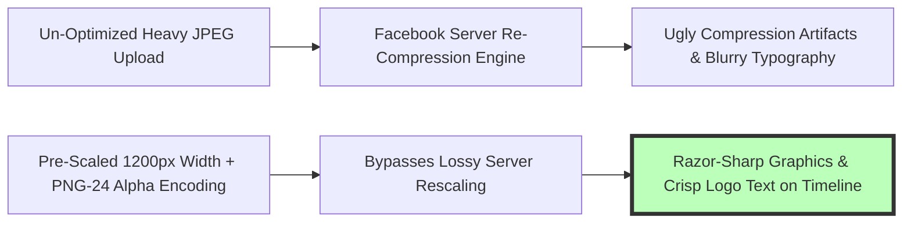

# How to Resize Images for Facebook: 2026 Dimensions & Cover Guide

Facebook remains the world's largest social media network, boasting over 3 billion active monthly users across global mobile and desktop platforms. For corporate brands, digital marketing agencies, e-commerce sellers, content creators, event organizers, and personal profile owners, publishing high-quality visual content—such as company cover banners, page profile avatars, promotional timeline feed posts, group header banners, and vertical story ads—is essential for audience engagement and brand authority.

However, content creators frequently encounter severe visual distortion when publishing photos on Facebook: uploaded images appearing blurry, pixelated, stretched, or awkwardly cropped across mobile screens. This occurs because Facebook enforces aggressive automated server-side compression algorithms on non-standard image uploads. When an uploaded photo doesn't match Facebook's exact target aspect ratios or exceeds recommended file size thresholds, Facebook's re-compression engine degrades visual sharpness, introduces ugly block compression artifacts, and clips essential typography or face photos.

This definitive guide provides a comprehensive tutorial on **how to resize images for Facebook in 2026**, details **official Facebook aspect ratios and pixel dimensions**, explains desktop vs. mobile cover banner focal geometry, outlines client-side HTML5 Canvas resampling math, and demonstrates how to crop and scale Facebook media assets locally and privately inside your web browser.

---

## Master Specification Matrix: Facebook 2026 Image Dimensions & Aspect Ratios

To ensure your visual assets display crisp across desktop monitors, tablets, and mobile smartphones, follow this official 2026 dimension specification matrix:

| Facebook Media Placement | Recommended Resolution (Pixels) | Aspect Ratio | Primary Visual Focus / Usage |
| :--- | :--- | :--- | :--- |
| **Personal Profile Picture** | **170x170 px (Display) / 320x320 px (Upload)**| 1:1 Square | Circular Profile Avatar Display |
| **Facebook Page Cover Banner**| **820x312 px (Desktop) / 640x360 px (Mobile)**| 16:9 / ~2.63:1 | Main Brand Header Graphics |
| **Facebook Group Cover Banner**| **1640x856 px** | 1.91:1 | Group Header Media Slots |
| **Facebook Event Cover Image**| **1920x1005 px** | 1.91:1 | Event Promotion Banners |
| **Landscape Feed Post** | **1200x630 px** | 1.91:1 | Standard Horizontal Timeline Post |
| **Portrait Feed Post (Tall)** | **1080x1350 px** | 4:5 | Max Mobile Timeline Screen Real Estate |
| **Square Feed Post** | **1200x1200 px** | 1:1 | Universal Desktop & Mobile Feed Post |
| **Facebook Stories & Reels** | **1080x1920 px** | 9:16 | Full-Screen Vertical Mobile Format |

---

## Technical Mechanics: Cover Banner Focal Geometry (Desktop vs. Mobile)

Why do Facebook Page cover banners look perfectly aligned on a desktop browser but get top or side text cut off on mobile smartphones?

```mermaid
graph TD
    A[Master Cover Graphic Uploaded at 1640x924 px] --> B{Device Viewport Rendering}
    B -- Desktop Viewport (820x312 px Display Window) --> C[Facebook Crops Top & Bottom Margins by 216px]
    B -- Mobile Viewport (640x360 px Display Window) --> D[Facebook Crops Left & Right Side Margins by 200px]
    
    C --> E[Central Safe Zone (1200x630 px) Remains Visible Everywhere!]
    D --> E
    style E fill:#bfb,stroke:#333,stroke-width:4px
```

### 1. The Mobile & Desktop Cover Safe Zone Rule
* **Desktop Display Window:** $820 \times 312\text{px}$ (Wide aspect ratio $\sim 2.63:1$).
* **Mobile Smartphone Display Window:** $640 \times 360\text{px}$ (Taller aspect ratio $16:9$).
* **Master Template Solution:** Design your cover banner at **$1640 \times 924\text{px}$**. Keep all critical text, brand logos, call-to-action buttons, and face photos inside the central **$1200 \times 630\text{px}$ "Safe Zone"**. This guarantees mobile screens won't clip side text while desktop browsers won't chop top/bottom logo elements.

### 2. Client-Side HTML5 Canvas Resampling Math
To resize an original photo $(W_{src}, H_{src})$ to target Facebook dimensions $(W_{dst}, H_{dst})$ without stretching, the resizer calculates scale factor $S$:
$$S = \max\left(\frac{W_{dst}}{W_{src}}, \frac{H_{dst}}{H_{src}}\right)$$

The canvas center-crops source coordinates $(X_{off}, Y_{off})$:
$$X_{off} = \frac{W_{src} - \frac{W_{dst}}{S}}{2}, \quad Y_{off} = \frac{H_{src} - \frac{H_{dst}}{S}}{2}$$

---

## Anti-Compression Sharpening Protocol: Preventing Facebook Blurriness

Facebook automatically re-compresses uploaded images to save server storage space. Follow these technical rules to bypass compression degradation:



* **Save as PNG-24 for Logos & Graphics:** Facebook compresses JPEGs aggressively. Uploading brand banners and typography graphics as **24-bit PNG files (`.png`)** forces Facebook to bypass lossy JPEG re-compression.
* **Keep File Sizes Under 1MB:** Files larger than 1MB trigger heavy server-side downscaling algorithms.
* **Exact Pixel Width Matching:** Always pre-scale images to exact target widths (**1200px** for posts, **1640px** for covers) prior to uploading.

---

## Step-by-Step Tutorial: How to Resize Images for Facebook

Follow this simple tutorial to resize and crop photos for Facebook using our free tool:

### Step 1: Upload Source Photo
Drag and drop your high-resolution master photo into our free client-side [Image Resizer](/tools/image-resizer) or [Crop Image Tool](/tools/crop-image).

### Step 2: Select Facebook Preset or Custom Dimensions
Choose an official Facebook aspect ratio preset:
* **Facebook Cover Banner:** $1640 \times 924\text{px}$ (Master Cover Canvas)
* **Facebook Portrait Post:** $1080 \times 1350\text{px}$ (4:5 Vertical Mobile Feed)
* **Facebook Landscape Post:** $1200 \times 630\text{px}$ (1.91:1 Horizontal Feed & Open Graph)

### Step 3: Adjust Crop Box & Position
Drag the interactive crop selection box to position key visual elements, brand typography, and focal subjects inside the central safe zone guidelines.

### Step 4: Export & Save PNG/JPEG Asset
Click "Resize & Download". The browser resizes, resamples, and encodes the image locally inside browser RAM, saving your crisp Facebook asset instantly ready for publishing.

---

## Step-by-Step Facebook Media Quality Checklist

Before uploading cover banners and media posts to Facebook, verify your assets against this quality checklist:

* **Aspect Ratio Verification:** Confirm feed post aspect ratio matches official 1:1, 4:5 vertical, or 1.91:1 horizontal layout guidelines.
* **Cover Safe Zone Verification:** Confirm vital company logo graphics and title text fit within the central $1200\times630\text{px}$ safe zone.
* **Format Selection Strategy:** Export brand graphics containing text as **PNG-24** and standard color photography as **JPEG (85% quality)**.
* **Exact Resolution Pre-Scaling:** Confirm image width is pre-scaled to exactly 1200px (posts) or 1640px (covers) to avoid server upscaling degradation.
* **Local Security Check:** Confirm image resizing and cropping occurred 100% locally in browser RAM memory without third-party server uploads.

---

## Facebook Open Graph (`og:image`) Meta Tag Specification

When sharing website URLs on Facebook, Facebook's web crawler fetches the `og:image` meta tag image:
* **Optimal `og:image` Dimensions:** **$1200\times630\text{px}$** (1.91:1 aspect ratio).
* **HTML Head Tag Implementation:**
  `<meta property="og:image" content="https://yourdomain.com/social-share.jpg">`
  `<meta property="og:image:width" content="1200">`
  `<meta property="og:image:height" content="630">`
* **Sharing Debugging Tool:** Use the official Facebook Sharing Debugger to scrape updated `og:image` metadata and invalidate stale preview caches.

---

## Color Profile Conversion: sRGB vs. Display P3 Color Shifts

Uploading photos tagged with Adobe RGB or ProPhoto RGB color profiles to Facebook causes muted, washed-out colors:
* **sRGB Color Space Mandate:** Facebook's image parser converts all uploaded image color vectors into standard **sRGB IEC61966-2.1**.
* **Color Space Tag Embedding:** Converting Wide Gamut (Display P3) photos to sRGB before uploading guarantees vibrant color accuracy across all consumer monitors and mobile screens.

---

## Frequently Asked Questions

### What is the best Facebook cover photo size in 2026?
The best master Facebook cover photo size is **$1640\times924\text{px}$**. Keeping critical text, call-to-action buttons, and brand logos inside the central $1200\times630\text{px}$ safe zone ensures your banner looks crisp and readable on both desktop computers and mobile smartphones.

### What is the best image format to prevent Facebook compression blurriness?
Upload logos, typography graphics, and promotional banners as **24-bit PNG files (`.png`)**. PNG files bypass Facebook's aggressive lossy JPEG re-compression algorithm, maintaining crisp typography and sharp vector lines on user timelines.

### What are the best aspect ratios for Facebook feed posts?
The best feed post ratios are **4:5 ($1080\times1350\text{px}$)** for vertical portrait posts (takes up maximum mobile screen real estate), **1:1 ($1200\times1200\text{px}$)** for universal square posts, and **1.91:1 ($1200\times630\text{px}$)** for horizontal posts.

### Why does Facebook crop my cover photo on mobile phones?
Desktop screens display cover banners at a wide ~2.63:1 aspect ratio ($820\times312\text{px}$), whereas mobile screens display a taller 16:9 ratio ($640\times360\text{px}$). Using a $1640\times924\text{px}$ canvas with centered text prevents mobile side-cropping issues.

### What is the recommended size for Facebook Story & Reel graphics?
Facebook Stories and Reels require a vertical **9:16 aspect ratio ($1080\times1920\text{px}$)**. Keep essential visual elements and text overlays away from the top 15% and bottom 20% safe zone margins to avoid overlap with native app UI buttons.

### Is my photo uploaded to a server when using this Facebook resizer tool?
No. All image scaling, matrix cropping, canvas resampling, and PNG encoding happen **100% inside your local web browser RAM**. Your private graphics, business assets, and personal photos never leave your computer or smartphone.