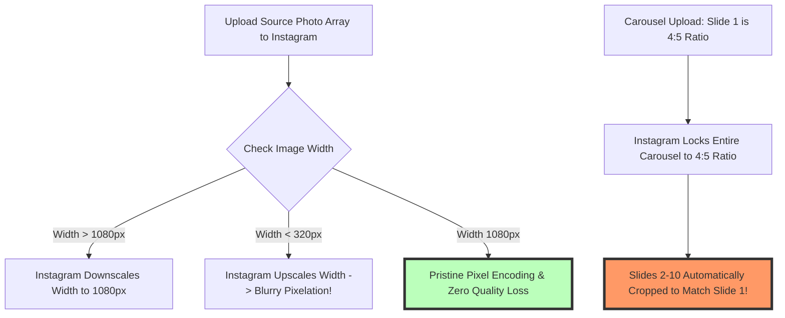

# How to Resize Images for Instagram: Post, Story & Reels Guide (2026)

Instagram is the world's primary mobile visual discovery platform, powering over 2 billion active monthly users across mobile smartphones and tablet devices. For social media influencers, visual content creators, digital brands, e-commerce stores, agency marketers, and professional photographers, sharing razor-sharp, perfectly dimensioned graphics across Instagram timeline feed posts, multi-slide carousels, Stories, and Reels is vital for maximizing algorithmic reach, viewer retention, and audience engagement.

However, creators frequently face frustrating visual quality degradation when uploading photos to Instagram: uploaded images appearing pixelated, blurry, or subject to awkward automatic center cropping. This occurs because Instagram enforces strict automated server compression protocols. If an uploaded image doesn't match Instagram's required **1000px–1080px width standard** or violates supported aspect ratios (such as **4:5 portrait**, **3:4 tall feed**, **1:1 square**, or **9:16 vertical full-screen**), Instagram's server downsampling engine stretches or squashes the photo, introducing severe compression artifacts, color distortion, and blurred detail.

This definitive guide provides a comprehensive tutorial on **how to resize images for Instagram in 2026**, details **official Instagram aspect ratios and pixel dimensions**, explains UI "safe zones" for Stories and Reels, outlines multi-slide carousel ratio matching rules, and demonstrates how to crop and scale Instagram photos locally and privately inside your web browser.

---

## Master Specification Matrix: Instagram 2026 Image Dimensions & Aspect Ratios

To ensure your photos render crisp across all iOS and Android smartphone viewports, follow this official 2026 specification matrix:

| Instagram Placement | Recommended Resolution (Pixels) | Aspect Ratio | Primary Visual Focus / Usage |
| :--- | :--- | :--- | :--- |
| **Portrait Feed Post (Best)**| **1080x1350 px** | 4:5 | Max Mobile Screen Real Estate |
| **Tall Feed Post (New Standard)**| **1080x1440 px** | 3:4 | Smartphone Camera Ratio Alignment |
| **Square Feed Post** | **1080x1080 px** | 1:1 | Classic Grid Layout & Multi-Slide |
| **Landscape Feed Post** | **1080x566 px** | 1.91:1 | Wide Horizon Photography |
| **Instagram Stories & Reels** | **1080x1920 px** | 9:16 | Full-Screen Vertical Mobile Video/Photo |
| **Profile Display Picture** | **320x320 px (Minimum)** | 1:1 | Circular Profile Display Avatar |

---

## Technical Mechanics: The 1080px Rule & Carousel Ratio Matching

How does Instagram's image processing engine handle multi-slide carousels and non-standard image resolutions?



### 1. The 1080px Width "Gold Standard"
Regardless of whether you are uploading a square (1:1), portrait (4:5), or landscape (1.91:1) photo, Instagram scales all feed images to a fixed **width of 1080 pixels**.
* Uploading an image wider than 1080px triggers Instagram's server downsampling algorithm.
* Uploading an image smaller than 320px wide forces Instagram to stretch the image, creating blurry, "mushy" pixels.
* **Optimal Upload Rule:** Always pre-scale images to **exactly 1080px width** prior to uploading.

### 2. Carousel Aspect Ratio Locking Rule
When uploading a multi-image carousel post (up to 20 slides), Instagram locks the aspect ratio of the **entire carousel to the aspect ratio of the first slide**:
* If Slide 1 is a 4:5 portrait ($1080\times1350\text{px}$), all subsequent slides will be forcibly cropped to 4:5, even if they were originally 1:1 square photos. Pre-resizing all slides to match $1080\times1350\text{px}$ guarantees zero unexpected cropping.

---

## Stories & Reels UI Safe Zones (9:16 Full-Screen Geometry)

Full-screen 9:16 vertical photos ($1080\times1920\text{px}$) risk having key content obscured by native Instagram interface overlays:

```mermaid
graph TD
    A[1080x1920 px Full Screen Story Canvas] --> B[Top 15% Safe Zone Margin: Top 288px]
    A --> C[Central Active Area (1080x1244 px): Place Text & Faces Here!]
    A --> D[Bottom 20% Safe Zone Margin: Bottom 384px]
    
    B --> E[Obscured by Username, Avatar & Progress Bars]
    D --> F[Obscured by Message Reply Box & Swipe-Up Stickers]
    style C fill:#bfb,stroke:#333,stroke-width:4px
```

* **Top 15% Safe Margin (Top 288px):** Keep text and logos below this boundary to avoid overlap with profile avatar headers and story progress bars.
* **Bottom 20% Safe Margin (Bottom 384px):** Keep essential graphics above this line to avoid overlap with message reply inputs and sticker trays.

---

## Step-by-Step Tutorial: How to Resize Images for Instagram

Follow this simple tutorial to crop and scale photos for Instagram using our free tool:

### Step 1: Upload Source Photo
Drag and drop your high-definition DSLR camera or smartphone photo into our free client-side [Crop Image Tool](/tools/crop-image) or [Image Resizer](/tools/image-resizer).

### Step 2: Select Instagram Aspect Ratio Preset
Select an official Instagram preset ratio:
* **Portrait Feed Post (Recommended):** $1080 \times 1350\text{px}$ (4:5 Vertical Ratio)
* **Tall Feed Post:** $1080 \times 1440\text{px}$ (3:4 Vertical Smartphone Ratio)
* **Stories & Reels:** $1080 \times 1920\text{px}$ (9:16 Full-Screen Ratio)

### Step 3: Position Crop Frame & Safe Zone
Adjust the interactive crop selection box to center primary visual subjects, faces, and brand logos. For 9:16 vertical stories, verify text overlays sit inside the central safe zone guidelines.

### Step 4: Export Crisp Image Asset
Click "Crop & Download". The browser resizes, resamples, and encodes the image locally inside browser RAM, exporting a pristine 1080px wide asset ready for instant uploading.

---

## Step-by-Step Instagram Media Quality Checklist

Before uploading photos and carousels to Instagram, verify your assets against this quality checklist:

* **Fixed 1080px Width Target:** Confirm master image width is pre-scaled to exactly 1080px to prevent server downsampling algorithms.
* **4:5 Portrait Ratio Preference:** Use 4:5 vertical portrait dimensions ($1080\times1350\text{px}$) for feed posts to maximize mobile timeline visibility.
* **Multi-Slide Carousel Ratio Uniformity:** Confirm all carousel slide assets share identical pixel dimensions before batch uploading to prevent forced cropping.
* **Story & Reels Safe Zone Alignment:** Confirm Story text overlays and logos sit between the top 15% and bottom 20% safe zone margins.
* **Local Privacy & Security Check:** Confirm image resizing and cropping occurred 100% locally in browser RAM memory without third-party server uploads.

---

## Instagram Profile Grid Aesthetic Geometry (1:1 Center Thumbnail Cropping)

While feed posts display as 4:5 vertical portraits ($1080\times1350\text{px}$) in the timeline, Instagram crops profile page feeds into a **1:1 square grid**:
* **Center Crop Geometry:** Instagram extracts a $1080\times1080\text{px}$ center crop from your $1080\times1350\text{px}$ portrait post to create the grid thumbnail.
* **Focal Subject Alignment:** Ensure primary face subjects, product logos, or typography graphics sit within the central $1080\times1080\text{px}$ square window so profile grid thumbnails look aesthetically balanced.

---

## High-DPI Retina Screen Downsampling & Sharpening Filters

Scaling ultra-high resolution DSLR camera photos ($6000\times4000\text{px}$) down to Instagram's $1080\times1350\text{px}$ standard requires advanced resampling kernels:
* **Lanczos3 Anti-Aliasing Kernel:** Pre-scaling images using a Lanczos3 sinc filter prevents high-frequency moiré patterns on detailed clothing textures and architecture lines.
* **Subtle Unsharp Masking:** Applying a subtle unsharp mask filter (Radius: 0.5px, Amount: 30%) prior to uploading compensates for Instagram's subsequent WebP re-encoding blur.

---

## Frequently Asked Questions

### What is the best image size for Instagram posts in 2026?
The best size for Instagram feed posts is **1080x1350 pixels (4:5 portrait ratio)**. This vertical format occupies maximum vertical screen real estate on mobile devices, keeping users engaged longer as they scroll through timelines.

### Why do my Instagram photos look blurry after uploading?
Instagram compresses photos that violate target resolution guidelines. Uploading photos smaller than 320px wide forces upscaling, while uploading photos wider than 1080px triggers heavy lossy server compression. Pre-scaling images to **exactly 1080px width** resolves upload blurriness.

### What is the 3:4 aspect ratio on Instagram?
Instagram widely supports a **3:4 aspect ratio (1080x1440 pixels)** for tall feed posts. This format aligns naturally with default mobile camera sensor captures, offering an even taller vertical presentation than standard 4:5.

### How do I prevent Instagram from cropping multi-slide carousel images?
Instagram locks multi-slide carousel aspect ratios to the **first slide**. If Slide 1 is 4:5, all subsequent slides will be cropped to 4:5. Pre-resizing all slides to match $1080\times1350\text{px}$ before uploading prevents unwanted automatic image cropping.

### What are the safe zone dimensions for Instagram Stories and Reels?
For 9:16 vertical full-screen media ($1080\times1920\text{px}$), keep key visual elements away from the **top 288px (15%)** and **bottom 384px (20%)** to prevent overlap with profile headers, message bars, and sticker controls.

### Is my photo uploaded to a server when using this Instagram resizer tool?
No. All image scaling, matrix cropping, Lanczos3 resampling, and canvas encoding happen **100% inside your local web browser RAM**. Your private graphics, business assets, and personal photos never leave your device.