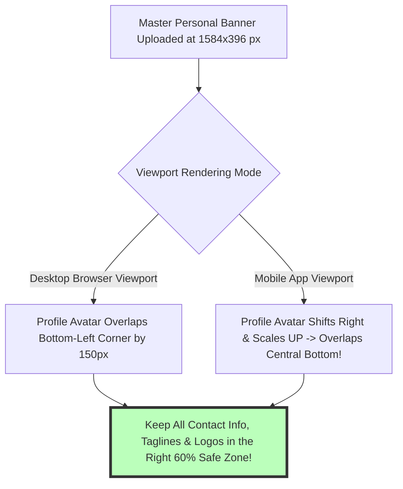
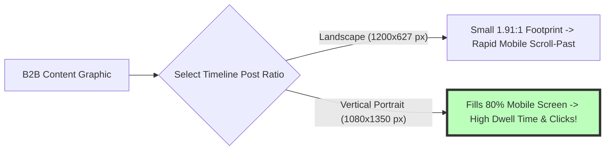

# How to Resize Images for LinkedIn: Profile, Cover Banner & Post Guide

LinkedIn is the world's premier B2B social networking platform, connecting over 1 billion professionals, corporate executives, recruiters, job seekers, enterprise sales teams, and business organizations worldwide. Establishing a polished, high-authority personal profile or company brand page on LinkedIn relies heavily on professional visual assets—including personal background cover banners, company page headers, circular profile avatars, single feed image posts, and multi-page PDF/slide carousels.

However, professionals frequently encounter embarrassing visual alignment flaws on LinkedIn: personal background banners getting cropped by the circular profile picture on mobile smartphones, corporate logos appearing blurry inside company headers, or text-heavy infographics getting clipped on desktop timelines. These issues occur because LinkedIn enforces strict, non-standard aspect ratios (**4:1 for personal banners**, **~5.9:1 for company banners**) and applies lossy server-side compression algorithms on non-compliant image uploads.

This definitive guide provides a comprehensive tutorial on **how to resize images for LinkedIn in 2026**, details **official LinkedIn aspect ratios and pixel dimensions**, explains profile avatar overlay geometry, outlines client-side HTML5 Canvas resampling math, and demonstrates how to crop and scale LinkedIn media assets locally and privately inside your web browser.

---

## Master Specification Matrix: LinkedIn 2026 Image Dimensions & Aspect Ratios

To ensure your professional profile and corporate branding display with executive precision across desktop and mobile screens, follow this official 2026 specification matrix:

| LinkedIn Media Placement | Recommended Resolution (Pixels) | Aspect Ratio | Primary Visual Focus / Usage |
| :--- | :--- | :--- | :--- |
| **Personal Profile Banner** | **1584x396 px** | 4:1 | Personal Profile Background Header |
| **Company Page Cover Banner** | **1128x191 px** | ~5.9:1 | Corporate Brand Page Header |
| **Personal Profile Avatar** | **400x400 px** | 1:1 Circular | Headshot / Professional Avatar |
| **Company Logo Avatar** | **300x300 px** | 1:1 Square | Corporate Brand Logo Avatar |
| **Portrait Feed Post (Best)** | **1080x1350 px** | 4:5 | Max Mobile Feed Screen Space |
| **Square Feed Post** | **1200x1200 px** | 1:1 | Universal B2B Feed Post |
| **Landscape Feed / Link Post**| **1200x627 px** | 1.91:1 | Shared Article & Blog Post Previews |
| **Life Tab Company Header** | **1128x376 px** | 3:1 | Careers & Culture Banner |

---

## Technical Mechanics: Profile Avatar Obstruction Geometry (Desktop vs. Mobile)

Why does a beautifully designed LinkedIn background cover banner look great on a desktop browser but get vital contact info covered by your profile photo on the mobile app?

### 1. The 60% Right-Side Safe Zone Rule for Personal Banners
* **Desktop Rendering:** The circular profile headshot ($150\times150\text{px}$) overlaps the bottom-left corner of the $1584\times396\text{px}$ banner.
* **Mobile App Rendering:** On smartphones, LinkedIn scales the profile avatar up and shifts its position toward the center of the lower banner region.
* **Safe Zone Rule:** Keep all critical text, email addresses, phone numbers, brand logos, and slogan typography inside the **right 60% of the banner canvas** ($X = 634\text{px} \dots 1584\text{px}$). Leave the left 40% reserved for background colors or subtle texture patterns.

### 2. Company Page Header Aspect Ratio (~5.9:1)
Company page headers ($1128 \times 191\text{px}$) are extremely wide and short. Text placed near top or bottom edges risks clipping during mobile responsive scaling. Center all typography within a $12\text{px}$ vertical margin padding.

---

## B2B Engagement Optimization: Portrait (4:5) vs. Square (1:1) Feed Posts

In B2B marketing, maximizing mobile feed dwell time is key to driving organic algorithmic impressions:

* **Vertical Portrait Posts (4:5 Ratio - $1080\times1350\text{px}$):** Occupies **80% of mobile smartphone screen real estate**, encouraging users to stop scrolling, read captions, and engage with content.
* **Document Slide Carousels (PDF Exports):** Exporting multi-page presentation decks as square ($1080\times1080\text{px}$) or portrait ($1080\times1350\text{px}$) PDFs generates interactive swipeable carousels on LinkedIn.

---

## Step-by-Step Tutorial: How to Resize Images for LinkedIn

Follow this simple tutorial to crop and scale professional photos for LinkedIn using our free tool:

### Step 1: Upload Source Image
Drag and drop your high-resolution master photo or corporate graphic asset into our free client-side [Image Resizer](/tools/image-resizer) or [Crop Image Tool](/tools/crop-image).

### Step 2: Select LinkedIn Preset
Choose an official B2B LinkedIn aspect ratio preset:
* **Personal Cover Banner:** $1584 \times 396\text{px}$ (4:1 Aspect Ratio)
* **Company Cover Banner:** $1128 \times 191\text{px}$ (~5.9:1 Wide Aspect Ratio)
* **Portrait Feed Post:** $1080 \times 1350\text{px}$ (4:5 Vertical Mobile Feed Ratio)

### Step 3: Align Safe Zone & Subject Position
Drag the interactive crop selection box to position headline typography, personal email contact details, company brand slogans, and call-to-action buttons inside the right 60% safe zone guidelines to prevent avatar overlap on mobile screens.

### Step 4: Export High-Resolution Asset
Click "Resize & Download". The browser resizes, resamples, and encodes the image locally inside browser RAM memory, exporting a sharp, zero-loss PNG-24 or high-quality JPEG asset ready for instant, professional corporate executive B2B profile page publishing.

---

## Step-by-Step LinkedIn Visual Quality Checklist

Before uploading banners and post graphics to LinkedIn, verify your assets against this quality checklist:

* **Right 60% Safe Zone Alignment:** Confirm executive contact info, email addresses, and brand taglines fit inside the right 60% of personal cover banners ($X = 634\text{px} \dots 1584\text{px}$).
* **4:1 Personal Aspect Ratio Precision:** Confirm personal background banner canvas dimensions match $1584\times396\text{px}$ exactly.
* **Company Header Precision:** Confirm corporate company page header cover dimensions match $1128\times191\text{px}$ with vertical centered padding.
* **Format Selection Strategy:** Export text-heavy banners and corporate logos as **PNG-24** to maintain sharp vector typography without JPEG compression block artifacts.
* **Local Privacy & Security Check:** Confirm image resizing and cropping occurred 100% locally in browser RAM memory without third-party server uploads.

---

## PDF Document Carousel Export Specifications

Interactive multi-page PDF documents generate 3x higher click-through rates on LinkedIn B2B feeds:
* **Target Canvas Dimensions:** Design carousel pages at **$1080\times1350\text{px}$ (4:5 Portrait)** or **$1080\times1080\text{px}$ (1:1 Square)**.
* **Vector Text PDF Compilation:** Exporting slides as vector PDFs ensures typography renders razor-sharp at any zoom level, while LinkedIn's feed reader enables native swipeable slide navigation.

---

## Headshot Avatar Framing & Eye-Line Centering Rules

A professional 1:1 profile photo ($400\times400\text{px}$) requires strategic composition framing:
* **The 60% Face Fill Rule:** Ensure your head and shoulders occupy approximately 60% of the circular frame area. Leaving 20% margin padding above the head prevents awkward cropping.
* **Eye-Line Alignment:** Position your eyes along the upper third horizontal grid line to establish direct eye contact and build trust with visiting recruiters and prospective B2B clients.

---

## Frequently Asked Questions

### What is the official LinkedIn personal background banner size in 2026?
The official size for a personal LinkedIn background banner is **$1584\times396\text{ pixels}$** (an exact 4:1 aspect ratio). Pre-scaling images to these exact dimensions guarantees crisp desktop and mobile rendering.

### Why is my text covered by my profile picture on LinkedIn mobile?
On mobile smartphones, LinkedIn shifts your circular profile avatar toward the center of the banner. Keeping all text, email contact details, and brand slogans inside the **right 60% of the banner canvas** ($X = 634\text{px} \dots 1584\text{px}$) prevents avatar obstruction.

### What is the recommended size for a LinkedIn company page banner?
The official size for a corporate LinkedIn company page cover banner is **$1128\times191\text{ pixels}$** (~5.9:1 aspect ratio). Keeping typography centered with vertical margin padding prevents mobile edge clipping.

### What is the best image size for LinkedIn feed posts?
The best format for LinkedIn feed posts is **$1080\times1350\text{ pixels}$ (4:5 portrait ratio)**. It occupies maximum vertical screen real estate on mobile devices, increasing dwell time and B2B user engagement.

### Should I upload LinkedIn banners as PNG or JPEG?
Upload banners containing typography, logos, or line art as **24-bit PNG files (`.png`)**. PNG files bypass LinkedIn's lossy JPEG re-compression algorithm, maintaining crisp, readable text and sharp vector lines.

### Is my headshot or company logo uploaded to a server when using this tool?
No. All image scaling, matrix cropping, canvas resampling, and PNG encoding happen **100% inside your local web browser RAM**. Your confidential headshots, executive profile photos, and corporate branding assets never leave your device.