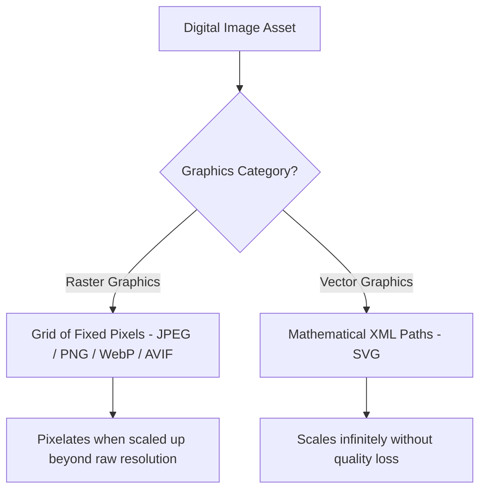

# Modern Web Image Formats Comparison: JPG, PNG, WebP, AVIF, SVG & PDF

In digital design, web development, photography, and publishing, choosing the correct image format for each visual asset is essential for performance and visual quality. Using the wrong format can lead to pixelated graphics, shifted colors, slow page load speeds, or unnecessarily large file sizes.

Different image formats are designed for different tasks. Raster formats (like JPEG, WebP, and AVIF) excel at storing detailed photographs using lossy compression. Vector formats (like SVG) scale infinitely without pixelating, making them ideal for logos and UI icons. Print containers (like TIFF and PDF) preserve high bit-depth color channels for physical publishing presses.

This guide provides a comprehensive comparison of all major digital image formats, breaks down their underlying compression mechanics, analyzes color space profiles, and offers a decision matrix to help you choose the best format for every use case.

---

## Master Comparison Matrix: Digital Image Formats

Below is a technical comparison of the most common digital image formats:

| Format Name | File Extension | Type | Primary Compression Mode | Max Color Bit Depth | Transparency (Alpha) | Primary Use Case |
| :--- | :--- | :--- | :--- | :--- | :--- | :--- |
| **AVIF** | `.avif` | Raster | AV1 Intra-Frame (Lossy/Lossless) | **10-bit / 12-bit** | **Yes** | Modern Web Banners & Photos |
| **WebP** | `.webp` | Raster | VP8 Prediction (Lossy/Lossless) | 8-bit | **Yes** | General Web Delivery |
| **JPEG / JPG**| `.jpg` / `.jpeg`| Raster | Discrete Cosine Transform (Lossy) | 8-bit | No | Web Photography & Legacy Fallbacks |
| **PNG** | `.png` | Raster | LZ77 + Huffman (Lossless) | 8-bit / 16-bit | **Yes** | Logos, Screenshots, UI Icons |
| **SVG** | `.svg` | Vector | XML Text Vector Paths (Lossless) | Infinite (CSS Color) | **Yes** | Scalable Logos, Icons, Diagrams |
| **TIFF** | `.tiff` / `.tif`| Raster | LZW / ZIP / None (Lossless) | 16-bit / 32-bit | **Yes** | Print Publishing & Master Archives |
| **HEIC** | `.heic` | Raster | HEVC Video Keyframe (Lossy) | 10-bit | **Yes** | Apple Mobile Camera Capture |
| **PDF** | `.pdf` | Hybrid | Container (Raster & Vector) | Unlimited (CMYK) | **Yes** | Print Pre-Press & Documents |

---

## Understanding Raster vs. Vector Math

The fundamental distinction in digital imaging is the difference between **Raster Graphics** and **Vector Graphics**:



### 1. Raster Graphics (Pixel Grids)
Formats like JPEG, PNG, WebP, AVIF, TIFF, and HEIC store images as a two-dimensional grid of colored pixels.
*   **Resolution Dependent:** Each pixel has specific color and brightness values. If you enlarge a raster image beyond its native resolution, the browser must stretch the pixels, resulting in blurriness and pixelation.
*   **Best Use Case:** Photographs, digital paintings, textures, and complex visual scenes with continuous color gradients.

### 2. Vector Graphics (Mathematical Paths)
Formats like SVG (and vector PDF files) define images using XML code that specifies anchor points, lines, curves, shapes, and color fills mathematically:
```xml
<svg width="100" height="100" viewBox="0 0 100 100" xmlns="http://www.w3.org/2000/svg">
  <circle cx="50" cy="50" r="40" fill="#3b82f6" stroke="#1d4ed8" stroke-width="4" />
</svg>
```
*   **Resolution Independent:** The browser calculates the shape coordinates dynamically, allowing vector graphics to scale infinitely without losing quality.
*   **Best Use Case:** Company logos, UI icons, line drawings, typography, and interactive diagrams.

---

## Detailed Breakdown of Key Image Formats

### 1. AVIF (AV1 Image File Format)
*   **Overview:** The newest web image standard, derived from the keyframe compression algorithms of the AV1 video codec.
*   **Advantages:** Files are **50% smaller than JPEGs** and **20% to 30% smaller than WebPs**. Supports 10-bit and 12-bit color depth, alpha transparency, and native High Dynamic Range (HDR) color profiles.
*   **Disadvantages:** Requires more CPU processing power to encode than legacy formats.

### 2. WebP
*   **Overview:** Developed by Google in 2010, WebP uses VP8 video keyframe compression algorithms.
*   **Advantages:** Supported by all modern web browsers. Produces files that are **25% to 35% smaller than JPEGs**, with support for lossy compression, lossless compression, alpha transparency, and animation.
*   **Disadvantages:** Limited to 8-bit color depth and standard dynamic range (sRGB).

### 3. JPEG / JPG (Joint Photographic Experts Group)
*   **Overview:** The universal standard for digital photography since 1992.
*   **Advantages:** Compatible with 100% of web browsers, mobile devices, and desktop applications.
*   **Disadvantages:** Uses lossy Discrete Cosine Transform (DCT) compression, which introduces blocky artifacts around sharp edges and text. Does not support transparent backgrounds.

### 4. PNG (Portable Network Graphics)
*   **Overview:** A lossless raster format designed for web graphics and screenshots.
*   **Advantages:** Preserves 100% of original pixel detail using DEFLATE compression. Supports full 8-bit alpha channel transparency.
*   **Disadvantages:** File sizes are significantly larger than JPEG, WebP, or AVIF when storing complex photographs.

### 5. SVG (Scalable Vector Graphics)
*   **Overview:** An XML-based vector format standard maintained by the W3C.
*   **Advantages:** Scales infinitely without losing quality, has a tiny file footprint, and can be styled dynamically using CSS or animated with JavaScript.
*   **Disadvantages:** Cannot store complex photographic images or detailed color gradients efficiently.

### 6. TIFF (Tagged Image File Format)
*   **Overview:** A high-precision container format used in commercial printing and photo archiving.
*   **Advantages:** Supports 16-bit and 32-bit color depths, multi-page layers, and CMYK color profiles using lossless compression (LZW or ZIP).
*   **Disadvantages:** File sizes are extremely large, and the format is not supported natively by web browsers.

---

## Decision Matrix: Choosing the Right Format for Your Project

Use this decision flowchart to select the correct image format for your specific use case:

```
                                  What type of asset are you optimizing?
                                              /      |      \
                                             /       |       \
                                            /        |        \
                                     (Photo)      (Logo/Icon)   (Print Project)
                                       /             |             \
                          Use AVIF or WebP        Use SVG       Use TIFF or PDF
                          (JPG as fallback)   (PNG as fallback)  (300 DPI CMYK)
```

---

## SVG XML ViewBox Math and Vector Styling Rules

Understanding SVG vector mathematics helps web developers optimize UI graphics effectively:
*   **The ViewBox Coordinate System:** An SVG file uses the `viewBox="min-x min-y width height"` attribute to establish an internal mathematical coordinate grid. When you scale an SVG container in CSS (e.g. `width: 100%`), the browser calculates proportional scaling vectors based on this viewBox ratio, ensuring smooth scaling across high-DPI displays without pixelation.
*   **CSS and SVG Interoperability:** Because SVG is written in XML text format, you can style vector path elements directly using external CSS properties (such as `fill: currentColor;` or `stroke-dasharray`). This allows developers to build responsive icons that adapt to light and dark theme modes without transferring extra image files.

---

## Color Space Profiles: sRGB vs. Adobe RGB vs. Display P3

Choosing the correct color space profile is essential for preventing color shifts across devices:
*   **sRGB:** The default, universally supported color space for digital web browsers, mobile displays, and social platforms.
*   **Adobe RGB:** A wider color gamut used by professional photographers and print publishers. If an Adobe RGB file is uploaded to the web without converting to sRGB, browsers will strip the profile and map the coordinates incorrectly, making the photo look washed out.
*   **Display P3:** A modern wide-gamut profile used by Apple Retina displays and mobile screens, offering richer red and green shades.

---

## Step-by-Step Optimization Workflow

Follow this workflow to select and prepare your image assets for web delivery:

1.  **Select the Right Format:** Use SVG for logos and icons, WebP or AVIF for photographic content, and PNG for graphics requiring transparent backgrounds.
2.  **Resize Before Compression:** Scale images to their exact display dimensions before compressing them. A $4000\times3000$ pixel camera photo scaled down to $1200\times900$ pixels instantly shrinks in file size before compression is applied.
3.  **Compress Locally:** Use a client-side compressor like our on-device [Image Compressor](/tools/image-compressor) to reduce file sizes directly in your browser without uploading files to external servers.

---

## Frequently Asked Questions

### Which image format is best for website loading speed?
**AVIF** and **WebP** are the best formats for website loading speed. They offer significantly better compression than JPEG and PNG, reducing file sizes by 30% to 50% and improving Largest Contentful Paint (LCP) performance scores.

### What is the difference between raster and vector formats?
Raster formats (like JPEG, PNG, WebP, and AVIF) store images as a grid of colored pixels, which blur when scaled up beyond their native resolution. Vector formats (like SVG) define images mathematically using XML coordinates, allowing them to scale infinitely without losing quality.

### Should I use PNG or JPEG for website photos?
Use **JPEG** (or next-gen **WebP/AVIF**) for website photos. PNG is a lossless format that produces unnecessarily large file sizes when storing complex photographic images.

### Does SVG support transparent backgrounds?
Yes. SVG is a vector format that renders shapes on a transparent canvas by default, allowing elements to blend seamlessly over any background color or image.

### Why won't my browser display TIFF or HEIC files?
TIFF and HEIC are uncompressed or high-efficiency camera container formats designed for printing and mobile storage. Web browsers do not support them natively to save bandwidth and prevent slow rendering times.

### How can I convert HEIC or WebP files securely?
To convert HEIC, WebP, or PNG files into standard web-ready formats without exposing your images to third-party cloud databases, use our free, browser-based [Image Converter](/image-converter). The tool runs locally in your browser, keeping your files private and secure.
