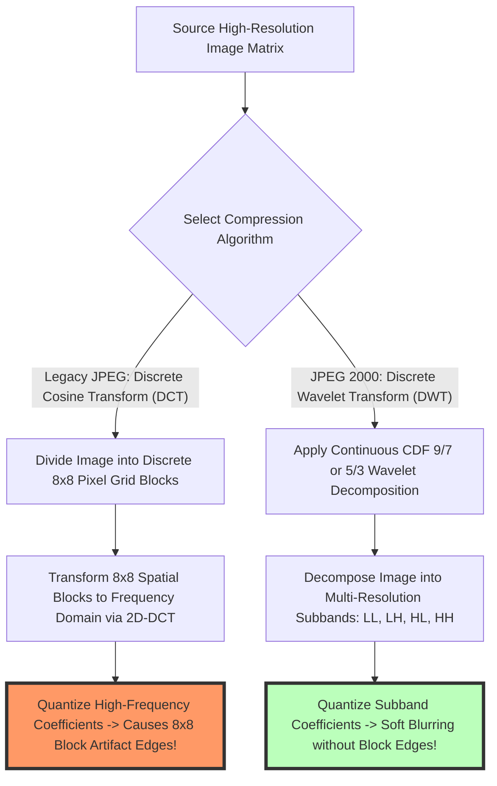

# JPEG vs JPEG 2000 Explained: Wavelet vs DCT Compression Guide

The evolution of digital image compression standards has shaped the modern internet, digital photography, medical imaging, geographic information systems (GIS), and film archival preservation for over three decades. Released in 1992 by the Joint Photographic Experts Group, the original **JPEG (ISO/IEC 10918-1)** standard established the foundation of digital photo sharing. However, standard JPEG exhibits severe compression limitations: visible 8x8 pixel block artifacts at high compression ratios, lack of native alpha transparency support, lossy-only compression algorithms, and generation loss during repeated edit saves.

In the year 2000, the ISO committee introduced **JPEG 2000 (JP2 / ISO/IEC 15444-1)** as the intended next-generation successor to legacy JPEG. Built upon advanced **Discrete Wavelet Transform (DWT)** mathematical algorithms instead of legacy **Discrete Cosine Transform (DCT)** block math, JPEG 2000 offered revolutionary features: **20% to 30% higher compression efficiency**, support for both lossy and **100% mathematically lossless compression**, 16-bit high-dynamic-range color channels, built-in alpha channel transparency, and progressive resolution streaming.

This guide provides a comprehensive technical comparison of **JPEG vs JPEG 2000**, details **DCT vs. Wavelet mathematical mechanics**, explains why JPEG 2000 failed to replace JPEG on the consumer web, explores specialized industrial use cases (DICOM medical imaging, digital cinema, GIS mapping), and demonstrates how to convert image formats locally in your browser.

---

## Master Comparison Matrix: JPEG vs. JPEG 2000 (JP2) Specifications

To evaluate how legacy JPEG compares to JPEG 2000 and modern web successors (WebP/AVIF), review this specification matrix:

| Technical Feature / Metric | Legacy JPEG (1992) | JPEG 2000 / JP2 (2000) | Modern AVIF / WebP (Next-Gen) |
| :--- | :--- | :--- | :--- |
| **Mathematical Basis** | **Discrete Cosine (DCT)** | **Discrete Wavelet (DWT)** | **Intra-Frame Video Codecs (AV1/VP8)**|
| **High-Ratio Artifacts** | **Ugly $8\times8$ Pixel Blocks** | **Soft Blurring (No Blocks)**| **Subtle Smooth Gradients** |
| **Lossless Compression**| ❌ No (Lossy Only) | **YES (Mathematical Lossless)**| **YES (Lossless WebP/AVIF)** |
| **Alpha Transparency** | ❌ No | **YES (8-Bit to 16-Bit Alpha)**| **YES (8-Bit Alpha)** |
| **Bit Depth Support** | **8-Bit per Channel (24-bit)** | **8 to 16+ Bit High Dynamic Range**| **8, 10, 12-Bit HDR** |
| **Web Browser Support** | **100% Universal (All Browsers)**| ❌ Safari Only (Legacy/Deprecating)| **98%+ Universal Web Support** |
| **Primary Industry** | **Web Photos & Consumer Media**| **DICOM Medical & Digital Cinema**| **Web Publishing & Mobile Apps** |

---

## Technical Mechanics: Discrete Cosine Transform (DCT) vs. Discrete Wavelet Transform (DWT)

What is the fundamental mathematical difference between legacy JPEG's $8\times8$ pixel block partitioning and JPEG 2000's continuous multi-resolution wavelet decomposition?



### 1. Discrete Cosine Transform (DCT) Block Math (Legacy JPEG)
Legacy JPEG splits the image canvas into independent $8\times8$ pixel blocks before applying the 2D-DCT formula:
$$F(u, v) = \frac{1}{4} C(u) C(v) \sum_{x=0}^{7} \sum_{y=0}^{7} f(x, y) \cos\left[\frac{(2x+1)u\pi}{16}\right] \cos\left[\frac{(2y+1)v\pi}{16}\right]$$

* At high compression ratios, high-frequency AC coefficients are quantized to zero. Because each $8\times8$ block is calculated independently, the boundaries between adjacent blocks become sharply visible, creating ugly "pixel block grid" artifacts.

### 2. Discrete Wavelet Transform (DWT) Subband Decomposition (JPEG 2000)
JPEG 2000 applies a continuous 2D Discrete Wavelet Transform across the entire image (or large tiles) using **Cohen-Daubechies-Feauveau (CDF 9/7)** wavelets for lossy compression, or **Le Gall 5/3** wavelets for reversible lossless compression:
* **Subband Matrix:** The DWT splits the image into four subband quadrants: **LL** (Low-pass Approximation), **LH** (Horizontal Detail), **HL** (Vertical Detail), and **HH** (Diagonal Detail).
* **Multi-Resolution Scalability:** Because DWT operates globally without $8\times8$ block boundaries, high compression ratios result in gradual, soft blurring rather than harsh block grids.

---

## Why JPEG 2000 Failed on the Web vs. Specialized Industry Dominance

Despite its technical superiority in 2000, JPEG 2000 failed to replace JPEG on consumer websites:

```mermaid
graph TD
    A[JPEG 2000 Introduced in Year 2000] --> B{Why JPEG 2000 Failed on the Web}
    B --> C[High Computational Complexity -> Melted 2000s CPU Hardware]
    B --> D[Patent & Licensing Uncertainty -> Royalty Fear among Browser Vendors]
    B --> E[No Native Chrome / Firefox Support -> Web Developers Avoided JP2]
    
    F[Specialized Niche Industry Adoption] --> G[DICOM Medical Imaging: X-Rays, MRIs, CT Scans require Lossless DWT]
    F --> H[Digital Cinema Package (DCP): 2K/4K Theatrical Movies use JP2 Master Video]
    F --> I[Geographic Information Systems (GIS): Satellite Maps use JP2 Multi-Resolution Zoom]
    style C fill:#f96,stroke:#333,stroke-width:4px
    style G fill:#bfb,stroke:#333,stroke-width:4px
    style H fill:#bfb,stroke:#333,stroke-width:4px
```

---

## Step-by-Step Tutorial: How to Convert Images to Modern Formats

Follow this simple tutorial to convert legacy JPEGs or JP2 images to modern web-friendly formats using our free tool:

### Step 1: Upload Source Image
Drag and drop your JPEG, PNG, or WebP files into our free [Image Converter](/tools/png-to-jpg) or [AVIF Converter](/tools/avif-to-jpg).

### Step 2: Choose Target Web Format (WebP or AVIF)
Select **WebP** for 98%+ browser compatibility or **AVIF** for state-of-the-art compression savings.

### Step 3: Adjust Quality & Compression Settings
Set quality between **80% and 85%** to balance small file size against crisp visual detail.

### Step 4: Process and Download Converted File
Click "Convert & Download". The browser decodes and encodes the image locally in RAM, exporting your file instantly.

---

## Step-by-Step Image Format Selection Quality Checklist

Before choosing an image format for digital projects, run your assets through this selection checklist:

* **Consumer Web Publishing:** Use **WebP or AVIF** for fast page loading and Core Web Vitals performance.
* **Medical / Archival Imaging:** Use **JPEG 2000 (JP2)** or **Lossless WebP** for mathematically exact lossless preservation.
* **Legacy Universal Compatibility:** Use **JPEG** for legacy email clients and old office software.
* **Transparent Graphic Logos:** Use **PNG-24 or WebP** to preserve alpha channel transparency.
* **Local Processing Check:** Confirm format conversion occurred 100% locally in browser RAM without server uploads.

---

## Region of Interest (ROI) Wavelet Masking & Bitplane Shifting

JPEG 2000 includes a unique capability missing from legacy JPEG: Region of Interest (ROI) compression:
* **Selective Lossless Sub-Regions:** Radiologists and satellite analysts can encode a specific bounding box (e.g., a tumor scan area or military installation) with **100% mathematically lossless fidelity**, while compressing the surrounding background area with heavy lossy compression.
* **Maxshift Algorithm Math:** The encoder shifts ROI wavelet coefficients in the bitplane domain above background coefficients, ensuring critical diagnostic regions decode first during progressive file streaming.

---

## JP2 Binary File Format Chunk Architecture (`.jp2` Atom Boxes)

JPEG 2000 files rely on a modular box-based binary structure similar to MP4 containers:
* **`jP2 ` Signature Box:** Verifies valid binary header identification (`0x0000 000C 6A50 2020`).
* **`ftyp` File Type Box:** Specifies ISO/IEC 15444-1 compliance profiles.
* **`jp2h` Header Box & `colr` Color Box:** Stores ICC color profiles, 16-bit channel bit depths, and alpha channel metadata.
* **`jp2c` Codestream Box:** Encapsulates EBCOT (Embedded Block Coding with Optimal Truncation) wavelet compressed tile bitstreams.

---

## Frequently Asked Questions

### What is the main difference between JPEG and JPEG 2000?
Legacy JPEG uses **Discrete Cosine Transform (DCT)** block math which creates $8\times8$ pixel block artifacts at high compression. JPEG 2000 uses **Discrete Wavelet Transform (DWT)** math, which eliminates block grids, supports 100% lossless compression, and includes alpha channel transparency.

### Why did JPEG 2000 fail to replace JPEG on the web?
JPEG 2000 required significant CPU processing power in the early 2000s, suffered from patent licensing fears, and was never natively adopted by major web browsers like Google Chrome or Mozilla Firefox.

### Where is JPEG 2000 (JP2) used today?
JPEG 2000 is the dominant standard in **DICOM medical imaging** (X-rays, MRIs, CT scans), **Digital Cinema (DCP)** for 2K/4K movie theater projections, and **GIS satellite mapping** due to its lossless compression and multi-resolution zooming.

### Which modern image format is better: JPEG 2000 or AVIF?
For web publishing, **AVIF** is vastly superior. AVIF offers higher compression efficiency than JPEG 2000, is supported by 98%+ of active web browsers, and incurs zero patent licensing fees.

### Is JPEG 2000 lossy or lossless?
JPEG 2000 supports **both lossy and 100% mathematically lossless compression**. Reversible Le Gall 5/3 wavelets enable exact pixel-for-pixel reconstruction without data loss.

### Is my image uploaded to a server when converting formats on this site?
No. All image decoding, matrix math, WebAssembly processing, and binary re-encoding happen **100% inside your local web browser RAM**. Your private graphics never leave your device.
