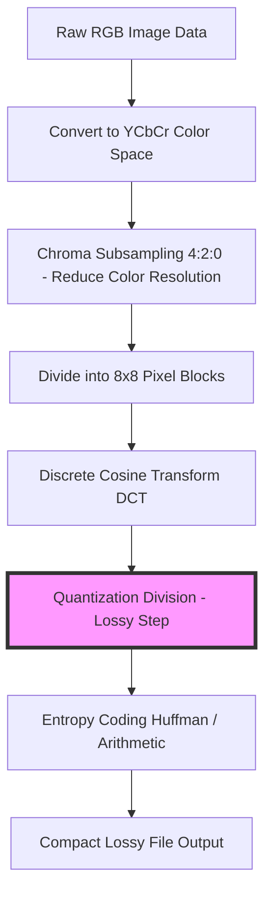
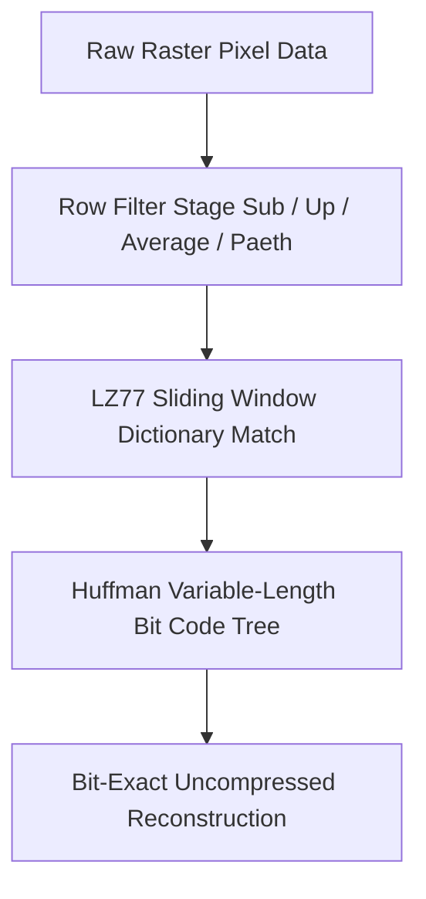
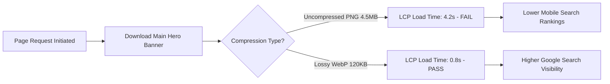

# Lossy vs. Lossless Image Compression: Core Web Vitals & SEO Guide

In web development, digital photography, and graphic design, image optimization is critical for performance and user experience. Image files account for a significant portion of total web page byte weight. Serving uncompressed image files slows down page load times, increases server bandwidth costs, and degrades Google Core Web Vitals metrics.

When optimizing digital images, developers must choose between two compression methodologies: **Lossy Compression** and **Lossless Compression**.

Understanding the mathematical mechanics, visual trade-offs, and file format applications of these compression types is essential for maintaining visual quality while keeping page load speeds fast.

This guide analyzes the technical mechanics of lossy and lossless algorithms, details the math behind Discrete Cosine Transforms and DEFLATE filtering, evaluates generation loss risks, and explains how compression strategy directly impacts Google's Largest Contentful Paint (LCP) performance metric.

---

## Technical Comparison: Lossy vs. Lossless Compression

To select the correct compression method for a given visual asset, we must compare their technical characteristics:

| Feature / Aspect | Lossy Compression | Lossless Compression |
| :--- | :--- | :--- |
| **Data Integrity** | Permanently discards redundant pixel data | 100% of original pixel data is preserved |
| **File Formats** | JPEG, WebP (lossy), AVIF (lossy), HEIC | PNG, GIF, WebP (lossless), TIFF, SVG, RAW |
| **Compression Ratio** | High (50% to 90% file size reduction) | Moderate (10% to 30% file size reduction) |
| **Visual Quality** | "Visually Lossless" at high settings (80-85%)| Identical bit-for-bit match to original |
| **Mathematical Tools** | Quantization, DCT, Chroma Subsampling | Entropy Coding (Huffman, LZ77, ANS, Paeth) |
| **Best Use Case** | Photography, continuous-tone scenes | Logos, line art, text, transparent assets |
| **Generation Loss** | Accumulates with each saving cycle | Zero generation loss across re-saves |

---

## The Mathematics of Lossy Compression (Quantization & DCT)

Lossy compression algorithms achieve significant file size reductions by discarding visual details that the human eye is less sensitive to—specifically high-frequency color variations.



The lossy compression pipeline relies on several distinct mathematical operations:

### 1. Spatial Frequency Conversion via Discrete Cosine Transform (DCT)
Image encoders divide pixel channels into $8\times8$ grids. The encoder applies the **Discrete Cosine Transform (DCT)** to convert the spatial pixel values into a matrix of spatial frequency coefficients:
$$F(u, v) = \frac{1}{4} C(u) C(v) \sum_{x=0}^{7} \sum_{y=0}^{7} f(x, y) \cos\left[\frac{(2x+1)u\pi}{16}\right] \cos\left[\frac{(2y+1)v\pi}{16}\right]$$
This transformation separates low-frequency values (smooth brightness trends, concentrated in the top-left of the matrix) from high-frequency values (sharp edges and fine noise, located in the bottom-right).

### 2. The Quantization Step (Data Loss)
**Quantization** is the step where data is permanently discarded. The frequency coefficients from the DCT phase are divided by values from a **Quantization Table** ($Q$) and rounded to integer values:
$$F_Q(u, v) = \text{round}\left( \frac{F(u, v)}{Q(u, v)} \right)$$
Higher compression settings use larger numbers in the quantization table. This rounds many high-frequency coefficients to zero, creating long runs of zeros that are easy to compress. However, if the quality setting is set too low (below 70%), it discards critical visual detail, resulting in **blocky artifacts** and fuzzy noise around sharp edges.

### 3. Generation Loss Risks
Because lossy encoders discard data based on quantization tables, opening a lossy JPEG, making minor edits, and saving it again applies a second pass of quantization. This process—known as **generation loss**—accumulates artifacts, causing image quality to degrade rapidly across repeated edit-and-save cycles.

---

## The Mechanics of Lossless Compression (Delta Filters & Entropy Coding)

Lossless compression algorithms reduce file size without altering a single pixel value. They work by removing statistical redundancy and restructuring how data is stored.



Lossless encoders (such as PNG or WebP Lossless) process data in two distinct stages:

### 1. Delta Filtering (Spatial Predictors)
Before compressing pixel bytes, the encoder applies mathematical filters to each row of pixels to make the data more uniform:
*   **Sub Filter:** Replaces a pixel's color value with the mathematical difference between itself and the pixel to its left.
*   **Up Filter:** Replaces a pixel's color value with the difference between itself and the pixel directly above it.
*   **Paeth Predictor:** Computes a linear function using the left, top, and top-left pixels to select the closest predictor value.

Converting raw color values into small difference values reduces spatial entropy, making the image data more repetitive and significantly easier to compress.

### 2. DEFLATE & Entropy Coding
Once filtered, the uniform byte stream is compressed using entropy algorithms:
*   **LZ77:** Replaces repeated sequences of data with references pointing to previous occurrences in the file stream.
*   **Huffman Coding:** Assigns shorter bit codes to frequently occurring symbols and longer codes to rare symbols.

Upon decoding, the browser reverses these operations to reconstruct a bit-for-bit exact copy of the original image.

---

## Impact on Google Core Web Vitals & Largest Contentful Paint (LCP)

Understanding compression type is directly related to optimizing Google Core Web Vitals, specifically **Largest Contentful Paint (LCP)**:



*   **The LCP Metric:** LCP measures the time it takes for the largest visual element above the fold (typically a hero banner image) to finish rendering on the user's screen. Google requires an LCP speed of **2.5 seconds or faster** for a page to pass.
*   **The Penalty of Using Lossless for Photos:** Uploading a photographic hero banner as a 4MB PNG file delays image download times, causing the page to fail Google's LCP assessment.
*   **The Lossy Optimization Solution:** Converting that photographic hero banner to a lossy WebP or AVIF image at **80% quality** shrinks the file size from 4MB to **120KB** (a 97% reduction) with no visible loss in visual quality. This allows the image to load quickly, ensuring the page passes Google's LCP benchmark.

---

## Decision Matrix: When to Use Lossy vs. Lossless Compression

Use this decision matrix to select the optimal compression mode for your website assets:

```
                      Is the asset a photo or continuous gradient?
                                      /        \
                                     /          \
                                 (YES)          (NO)
                                 /                  \
                    Use LOSSY Compression       Is background transparency required?
                    (WebP / AVIF / JPEG)              /               \
                                                     /                 \
                                                 (YES)                 (NO)
                                                 /                         \
                                     Use LOSSLESS PNG               Is it a vector logo?
                                    or LOSSY WebP Alpha             /             \
                                                                (YES)             (NO)
                                                                /                     \
                                                        Use SVG Vector          Use LOSSLESS PNG
```

### Summary of Best Uses:
*   **Use Lossy (WebP / AVIF / JPEG) for:** Product photography, portfolio galleries, background images, and social media banners.
*   **Use Lossless (PNG / SVG / WebP Lossless) for:** Logos, website icons, text-heavy graphics, screenshots, and line illustrations.

---

## Step-by-Step Optimization Workflow

To optimize your images for web delivery, follow this workflow:

1.  **Categorize Assets:** Identify whether each asset is a photograph (use lossy compression) or a text/logo graphic (use lossless compression).
2.  **Scale Dimensions First:** Resize images to their exact display dimensions before compressing them. A $4000\times3000$ pixel photo scaled down to $1200\times900$ pixels instantly shrinks in file size before compression is applied.
3.  **Compress Locally:** Use a client-side compressor like our on-device [Image Compressor](/tools/image-compressor) to reduce file sizes directly in your browser without uploading files to external servers.
4.  **Set Quality Ratings:** For lossy photographs, set compression quality between **80% and 85%** to maximize file size savings while maintaining visual quality.

---

## Frequently Asked Questions

### What is the difference between lossy and lossless image compression?
Lossy compression reduces file size by permanently discarding minor visual details and color variations that are less noticeable to the human eye. Lossless compression reduces file size by optimizing how pixel data is stored without altering a single pixel value.

### Does lossy compression ruin image quality?
Not when used at appropriate settings. At quality settings between **80% and 85%**, lossy compression produces "visually lossless" results—reducing file sizes by up to 80% with no difference discernible to the human eye.

### How does lossy compression affect Google Core Web Vitals and LCP?
Lossy compression significantly reduces image file sizes, allowing large hero banners to download much faster. Fast image download times improve your Largest Contentful Paint (LCP) score, helping your pages pass Google's Core Web Vitals assessment.

### What is generation loss in lossy images?
Generation loss is the cumulative degradation in image quality that occurs when a lossy file (like a JPEG) is edited and re-saved multiple times. Each save cycle applies another pass of lossy quantization, introducing visible artifacts over time.

### Which file formats support lossless compression?
PNG, GIF, WebP (lossless mode), TIFF, SVG, and RAW formats support lossless compression.

### How can I compress my images safely without losing quality?
To compress your images without exposing files to external cloud databases, use our free, browser-based [Image Compressor](/tools/image-compressor). The tool runs locally in your browser, keeping your files private and secure.
