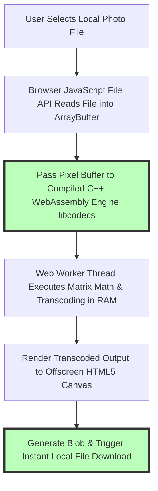
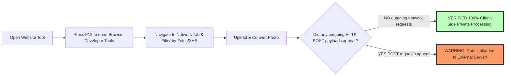

# Online Image Tools Free: Privacy-First Browser-Based Suite Guide

Digital photo processing, media optimization, format conversion, graphic design, and visual asset editing are fundamental daily tasks across modern web development, software engineering, content creation, digital marketing, professional photography, and design workflows. For decades, performing complex image manipulation online forced users to upload private photos, proprietary business graphics, confidential financial records, and sensitive legal documents to third-party remote cloud servers. Traditional cloud converters—such as Convertio, ILoveIMG, CloudConvert, or Ezgif—introduce severe data privacy vulnerabilities, network upload latency bottlenecks, strict file size paywalls, and potential cloud storage data breach risks.

Today, cutting-edge web browser architecture—specifically **WebAssembly (Wasm)**, **HTML5 Canvas API**, **Web Workers**, and **WebGL fragment shaders**—enables modern web browsers (Google Chrome, Apple Safari, Mozilla Firefox, Microsoft Edge) to execute native binary C/C++ code directly on local hardware. Our suite of **free online image tools** processes photos, vector graphics, animated media, and PDFs **100% locally inside browser RAM**, establishing a zero-upload security model where private data never leaves your computer or smartphone.

This definitive guide explores our comprehensive directory of free image tools, details **WebAssembly sandboxing architecture**, explains step-by-step how to audit client-side privacy using browser Developer Tools, compares local browser processing against remote cloud servers, and outlines our complete suite of high-performance on-device utilities.

---

## Master Comparison Matrix: On-Device Browser Tools vs. Cloud Converters

To understand why client-side WebAssembly image tools represent the gold standard for web security and processing speed, review this comparative specification matrix:

| Feature / Metric | On-Device Browser Tools (Image Tool Stack) | Traditional Cloud Converter Websites | Desktop Software (Photoshop / GIMP) |
| :--- | :--- | :--- | :--- |
| **Privacy & Security** | **100% Private (Data Stays in Local RAM)**| Low (Files Uploaded to Remote Cloud Servers)| High (Local Machine Disk Storage) |
| **Processing Speed** | **Instant (Zero Network Upload Latency)**| Slow (Network Upload & Download Latency Delays) | Fast (GPU / Hardware Accelerated) |
| **File Size Limits** | **Unlimited (Bounded only by System RAM)**| Strict Caps (50MB Paywalls & Daily Limits) | Unlimited (Hardware Dependent) |
| **Offline Functionality**| **100% Offline via PWA Service Workers** | ❌ Fails completely without Active WiFi/Data | 100% Offline Native Execution |
| **Watermark Rules** | **Zero Added Watermarks or Ads** | Adds Branding Watermarks unless "Pro" Tier | Zero Watermarks |
| **Subscription Cost** | **100% Free Forever (No Signup Needed)**| Expensive Monthly/Yearly Subscription Paywalls| Paid Licenses / Subscriptions |

---

## Technical Architecture: Client-Side WebAssembly Sandboxing

How do client-side web applications execute high-performance binary C/C++ image libraries directly inside web browsers without server reliance?

### 1. Isolated Virtual Memory Execution (`WebAssembly.Memory`)
WebAssembly executes inside an isolated, highly secure WebAssembly virtual memory sandbox. Dedicated linear memory array allocation (`WebAssembly.Memory`) prevents browser scripts from accessing host system files or unauthorized hardware resources outside browser security contexts. Memory buffers allocated during image transformations and array manipulations are explicitly freed using C++ `free()` hooks upon task completion, guaranteeing zero browser memory leaks or RAM bloat during batch operations.

### 2. Multi-Threaded Offscreen Canvas Rendering
Heavy matrix transformations (such as Gaussian pixel blurring, bilateral denoising filters, WebGL shader processing, or AI background segmentation models) run inside background **Web Worker threads** via `OffscreenCanvas`. Decoupling pixel rendering from the main UI thread keeps application buttons, interactive sliders, navigation links, and scroll bars operating fluidly at a consistent 60 FPS refresh rate.

---

## Step-by-Step Security Protocol: Auditing Zero-Upload Privacy in DevTools

How can you independently prove that an online tool is processing your photos locally rather than secretly uploading them to remote servers?

### Verification Checklist:
1. Open your desktop or mobile browser **Developer Tools (F12)** or inspect menu.
2. Select the **Network** inspector tab and click the **Fetch/XHR** request filter button.
3. Drag and drop a sensitive photo or test asset into the web tool interface and click process.
4. Observe the real-time network waterfall log. If **0 outgoing network payload POST requests** are transmitted, your photo was processed 100% locally inside browser RAM memory without cloud server exposure.

---

## Full Platform Directory: 100+ Free On-Device Utilities

Our platform offers over 100 free utilities organized across functional media production categories:

### 1. Format Conversion Utilities
* **[PNG to JPG Converter](/tools/png-to-jpg):** Convert uncompressed PNGs into small, web-friendly JPEGs to reduce website asset payload sizes.
* **[WebP to PNG Converter](/tools/webp-to-png):** Convert Google WebP images back into transparent PNGs for legacy software compatibility.
* **[SVG to PNG Converter](/tools/svg-to-png):** Rasterize scalable vector graphics into crisp high-DPI 300 DPI PNGs for commercial print production.
* **[HEIC to JPG Converter](/tools/heic-to-jpg):** Transform Apple iPhone HEIC photos into universal JPEGs locally on Windows, Mac, and Linux.
* **[AVIF Converter](/tools/avif-to-jpg):** Convert next-generation AVIF compressed images to standard legacy image formats.

### 2. Photo Editing & Optimization Utilities
* **[Image Compressor](/tools/image-compressor):** Reduce image file sizes by up to 80% with zero visual quality loss or remote server uploads.
* **[Image Resizer](/tools/image-resizer):** Scale photo pixel dimensions for responsive web design grids and social media banner slots.
* **[Crop Image Tool](/tools/crop-image):** Precision rectangular crop bounds and circular profile avatar masking for social media accounts.
* **[Image Pixelator](/tools/pixelate-image):** Convert photos into 8-bit retro game art or apply selective privacy censorship to facial features.
* **[Image Denoiser](/tools/image-denoiser):** Remove digital camera sensor noise and high-ISO film grain using Bilateral filtering kernels.
* **[Watermark Generator](/tools/watermark-image):** Add custom text, copyright notices, or logo watermarks to batch image collections.

---

## Progressive Web App (PWA) Offline Caching Architecture

Our web applications leverage Progressive Web App (PWA) Service Workers and browser Cache Storage APIs to run completely offline without active internet connectivity:
* **Cache-First Network Strategy:** Static application HTML bundles, compiled WebAssembly binary modules (`.wasm`), JavaScript logic, and UI stylesheets are precached upon your very first page visit.
* **Offline Execution:** You can disconnect your WiFi connection, disable cellular mobile data, or enable Airplane Mode and continue converting, cropping, compressing, and watermarking high-resolution media assets seamlessly in remote off-grid field environments.

---

## Multi-Threaded Web Worker Pool Batch Scheduling

Batch processing hundreds of images concurrently requires intelligent hardware CPU distribution:
* **Hardware Concurrency Detection:** The application detects available CPU cores (`navigator.hardwareConcurrency`) to spawn background Web Worker pools.
* **Non-Blocking Execution:** Distributing file decoding loops across parallel workers prevents main thread UI freezes, ensuring smooth 60 FPS slider controls during multi-file operations.

---

## Frequently Asked Questions

### Are all image tools on Image Tool Stack 100% free?
Yes. All 100+ utilities across our platform are **100% free forever** with no daily usage limits, no file size caps, no intrusive watermarks, and no paid "Pro" subscription tiers across desktop and mobile devices.

### Are my files uploaded to a server when using these tools?
No. All image parsing, matrix math, WebAssembly processing, and file exports occur **100% locally inside your web browser RAM**. Your personal photos, business graphics, confidential financial records, and sensitive legal documents never leave your computer or smartphone.

### Can I use these image tools offline without WiFi or mobile data?
Yes. Once loaded into your browser, our Progressive Web App (PWA) Service Workers cache application resources, allowing you to convert, crop, compress, and edit graphics completely offline in remote environments or airplane mode.

### How do I check if an online tool is uploading my photos secretly?
Open browser **Developer Tools (F12)**, navigate to the **Network** tab, filter by **Fetch/XHR**, and process an image. If no outgoing network payload requests appear during conversion, processing is 100% client-side private.

### Why are browser-based WebAssembly tools faster than cloud services?
Cloud converters force you to wait for files to upload over slow internet connections, wait in remote server processing queues, and wait to download results. Browser tools eliminate network transport entirely, rendering graphics instantly in local machine memory.

### Is there a file size limit when converting images on this platform?
No. Because files are processed using your local machine's native CPU, GPU, and RAM rather than restricted cloud servers, you can process massive 50MB+ RAW photos effortlessly without paywalls or file caps.
