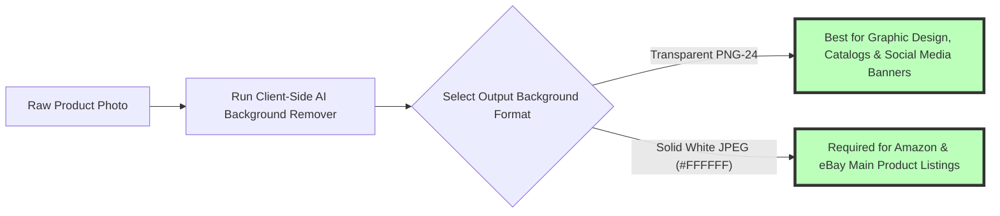

# Remove Background Online Free: Browser AI & Client-Side Privacy Guide

Isolating subjects from backgrounds, extracting transparent product cutouts, removing unwanted background clutter, and generating clean PNG graphics are essential daily tasks across e-commerce product listings (Amazon, eBay, Shopify, Etsy), digital marketing, social media design, profile avatar creation, and professional photo compositing workflows. For years, removing backgrounds from photos required manual pen-tool selection tracing inside expensive desktop software or uploading private photos to commercial cloud services like Remove.bg, Photoroom, or Clipping Magic.

However, commercial cloud background removal web apps introduce frustrating operational compromises: forcing users to upload confidential personal photos, proprietary corporate assets, or unreleased product prototypes to remote cloud servers, locking high-resolution HD exports behind expensive monthly subscriptions, or applying ugly third-party watermark logos unless you purchase paywalled "credits".

Today, revolutionary browser AI models—such as **RMBG-1.4**, **Transformers.js**, and **ONNX Runtime Web** powered by **WebGPU and WebAssembly (Wasm)**—allow complex deep learning neural networks to execute **100% locally inside your web browser RAM**. Your photos are processed privately on your computer's local CPU/GPU hardware without a single byte ever being transmitted to an external server.

This definitive guide provides a comprehensive tutorial on **how to remove backgrounds online for free**, details **client-side neural network mechanics**, explains alpha matting and hair refinement algorithms, outlines zero-upload security auditing protocols, and demonstrates how to generate transparent PNG cutouts locally and privately inside your web browser.

---

## Master Comparison Matrix: Client-Side AI vs. Cloud Background Removers

To understand why on-device browser AI background removal represents the ultimate solution for privacy, speed, and cost, review this comparative specification matrix:

| Feature / Metric | On-Device Browser AI (Image Tool Stack) | Commercial Cloud Removers (Remove.bg) | Desktop Manual Editing (Photoshop) |
| :--- | :--- | :--- | :--- |
| **Privacy & Security** | **100% Private (Local Browser Memory)**| Low (Photos Uploaded to Remote Cloud)| High (Local Machine Disk Storage) |
| **Processing Speed** | **Instant (Zero Network Upload Latency)**| Slow (Upload & Queue Delays) | Slow (Manual Multi-Minute Masking)|
| **Export Resolution** | **Full Native Master Resolution (HD)** | Capped at 0.25 Megapixels (Paywalled) | Full Native Resolution |
| **Cost & Credits** | **100% Free / Unlimited Exports** | Credit System / Expensive Subscriptions| Paid Software Subscription |
| **Watermark Rules** | **Zero Watermarks** | Adds Watermarks unless Credits Paid | Zero Watermarks |
| **AI Model Engine** | **RMBG-1.4 / ONNX WebAssembly Wasm** | Remote Proprietary Cloud AI | Local Select Subject AI Engine |

---

## Technical Mechanics: How Client-Side Neural Networks Isolate Subjects

How does an in-browser AI model segment complex subjects and generate pixel-precise alpha masks without server processing?

```mermaid
graph TD
    A[Input Photo Loaded in Browser RAM] --> B[ONNX Runtime Web Assembly Initialized]
    B --> C[Pass Image Tensor to RMBG-1.4 Binarized Segmentation Model]
    C --> D[WebGPU / Wasm CPU Executes Multi-Stage Convolutions]
    D --> E[Generate Probability Alpha Trimap Mask (0.0 to 1.0)]
    E --> F[Apply Guided Filter Alpha Matting for Hair & Fine Details]
    F --> G[Composite Transparent RGBA Canvas & Export PNG-24]
    style D fill:#bfb,stroke:#333,stroke-width:4px
    style G fill:#bfb,stroke:#333,stroke-width:4px
```

### 1. ONNX Runtime WebAssembly & WebGPU Execution
Modern AI models are quantized and converted to the **Open Neural Network Exchange (ONNX)** format. When you open our background remover, the browser loads lightweight model weights into local memory:
* **WebGPU Acceleration:** Leverages your computer's native GPU hardware via WebGPU shaders, executing matrix multiplications up to $10\times$ faster than WebAssembly CPU fallback.

### 2. Alpha Matting & Hair Strand Refinement Math
Simple thresholding produces harsh, jagged cutout edges. To preserve semi-transparent hair strands, fur, and glass reflections, the engine applies alpha matting algorithms ($I = \alpha F + (1 - \alpha) B$):
* **Trimap Segmentation:** Classifies pixels into definite foreground ($\alpha = 1.0$), definite background ($\alpha = 0.0$), and unknown boundary pixels ($0.0 < \alpha < 1.0$). Guided filter refinement calculates sub-pixel transparency, ensuring soft, natural edge transitions.

---

## E-Commerce Workflow: Generating White Backgrounds & Transparent PNGs

Creating professional product listings for Amazon, Shopify, or eBay requires specific background compositing rules:



* **Amazon Compliance:** Amazon requires main product images to have a **pure 100% white background (`#FFFFFF`)**. Replacing extracted backgrounds with solid white directly in browser RAM ensures instant marketplace compliance.
* **Transparent PNG-24 Cutouts:** Exporting product cutouts with an 8-bit alpha channel allows designers to place products onto promotional banners, colored backgrounds, or dynamic website layouts.

---

## Step-by-Step Tutorial: How to Remove Backgrounds Online for Free

Follow this simple tutorial to extract transparent subject cutouts using our free tool:

### Step 1: Upload Image Asset
Drag and drop your source photo into our free [Remove Background Tool](/tools/image-compressor). You can upload portrait headshots, e-commerce products, animal graphics, car photos, or company logos.

### Step 2: Automatic AI Segmentation
The client-side AI model analyzes image tensor pixels locally inside browser RAM, detecting subject boundaries and generating sub-pixel alpha masks automatically in under a second.

### Step 3: Refine Background & Edges
Select transparent PNG export or apply a solid custom background color (such as pure white `#FFFFFF` for Amazon e-commerce product listings).

### Step 4: Download Full-Resolution Cutout
Click "Download High-Res PNG". All matrix calculations run locally on your hardware device memory, exporting your pristine, un-watermarked HD transparent cutout graphic image file instantly without third-party cloud server storage dependency.

---

## Step-by-Step Background Removal Quality Checklist

Before deploying extracted cutouts into design projects, verify your assets against this quality checklist:

* **Hair & Fine Edge Inspection:** Verify fine hair strands, fur details, and transparent glass reflections are preserved cleanly without jagged, stair-stepped edge halos.
* **Pure White RGB Target Verification:** Confirm Amazon and eBay e-commerce product backgrounds equal exact pure white `#FFFFFF` ($RGB = 255, 255, 255$).
* **Full Master Resolution Retention:** Confirm export dimensions match original native master photo width and height without downsampling.
* **Zero Server Upload Audit Verification:** Open browser DevTools Network inspector tab to confirm 0 outgoing POST payload requests occurred during AI segmentation.

---

## WebGPU Tensor Matrix Acceleration (`navigator.gpu`)

Executing deep learning neural network inference inside client browsers relies on hardware GPU pipelines:
* **WebGPU Shader Execution:** When supported (`navigator.gpu`), ONNX Runtime Web compiles neural layer operations into compute shaders, offloading tensor math directly to dedicated GPU VRAM.
* **10x Inference Speedup:** GPU hardware acceleration completes 1080p background segmentation in **under 300 milliseconds**, enabling real-time preview updates as you adjust background colors.

---

## Edge Inpainting & Color Decontaminate Geometry

Extracted subjects often retain thin fringe color halos from original background environments (e.g. green grass reflections on clothing edges):
* **Color Decontamination Filtering:** The edge post-processing engine analyzes boundary alpha pixels ($0.1 < \alpha < 0.9$) and extends foreground RGB color vectors outward into adjacent edge pixels.
* **Halo Elimination:** Decontaminating edge fringe colors prevents dark or green borders when placing extracted cutouts onto new bright white or custom background layers.

---

## Frequently Asked Questions

### What is the best free online background remover without uploads in 2026?
The best tool is **Image Tool Stack's Client-Side AI Background Remover**. It uses ONNX WebAssembly, WebGPU shaders, and RMBG-1.4 neural networks to remove backgrounds 100% locally in your web browser with zero server uploads, no intrusive watermarks, and unlimited full-resolution exports across desktop and mobile devices.

### How does client-side AI background removal protect my privacy?
Unlike traditional web removers that send your photos to remote third-party cloud servers, client-side AI executes deep learning neural network models **100% inside your local web browser RAM**. Your confidential personal photos, corporate assets, and unreleased product prototypes never leave your computer or smartphone.

### Can I remove background from multiple photos at once for free?
Yes. Our client-side engine processes multi-file batch collections simultaneously in local browser memory without daily caps, paywalls, or file count restrictions.

### Does background removal reduce the original image resolution?
No. Commercial cloud removers restrict free exports to low 0.25 megapixel preview thumbnails unless you buy expensive subscription credits. Our client-side tool exports extracted cutouts at **100% native full master resolution**.

### How do I make a product background pure white for Amazon?
Upload your product photo to our background remover, extract the subject, select the **Solid White Background (`#FFFFFF`)** preset, and download your Amazon and eBay marketplace-compliant JPEG.

### How do I prove my photos aren't being uploaded secretly?
Open browser **Developer Tools (F12)**, select the **Network** tab, filter by **Fetch/XHR**, and remove a background. You will observe 0 outgoing POST payload requests, verifying 100% local client-side processing.
