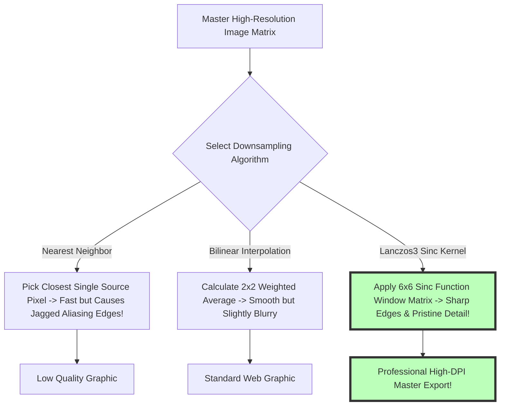
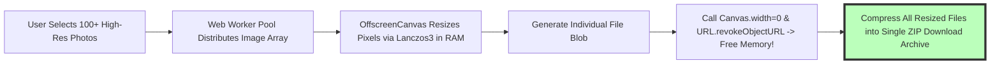

# Resize Image Online Free: Client-Side Batch Photo Scaling Guide

Changing image pixel dimensions, adjusting aspect ratios, scaling photo resolutions for web publishing, and reducing digital file sizes are fundamental daily requirements across web development, software engineering, content creation, digital marketing, professional photography, e-commerce, and social media management workflows. Whether preparing high-resolution DSLR photographs for a desktop website banner ($1920\times1080\text{px}$), scaling smartphone headshots for a LinkedIn profile avatar ($400\times400\text{px}$), or formatting product catalog photos for Shopify, Etsy, and Amazon, resizing images accurately without introducing fuzzy blurriness or visual distortion is essential.

However, traditional online image resizers—such as PicResize, ResizePixel, or ILoveIMG—force users to upload private photos, business graphics, and legal documents to remote cloud servers, enforce strict file count paywalls, or apply lossy re-compression algorithms that degrade visual sharpness and introduce compression artifacts.

Today, advanced browser APIs—including **HTML5 OffscreenCanvas**, **Lanczos3 sinc kernel interpolation filters**, and **WebAssembly (Wasm)** memory buffers—allow modern web browsers to scale images **100% locally inside your device RAM**. Your photos are processed privately on your local CPU without a single byte ever being transmitted to an external server.

This definitive guide provides a comprehensive tutorial on **how to resize images online for free**, details **resampling interpolation math (Bilinear, Bicubic, Lanczos3)**, explains aspect ratio lock calculations, demonstrates bulk batch photo scaling, and outlines zero-upload privacy safeguards.

---

## Master Comparison Matrix: Client-Side Resizing vs. Cloud Resizers

To evaluate why client-side browser image resizing is superior for privacy, precision, and processing speed, review this comparative specification matrix:

| Feature / Metric | Client-Side Resizer (Image Tool Stack) | Traditional Cloud Resizers (PicResize) | Desktop Editors (Photoshop / GIMP) |
| :--- | :--- | :--- | :--- |
| **Privacy & Security** | **100% Private (Local Browser RAM)** | Low (Photos Uploaded to Remote Cloud)| High (Local Machine Disk Storage) |
| **Processing Speed** | **Instant (Zero Network Upload Delays)**| Slow (Network Upload & Download Delays)| Fast (Hardware Accelerated) |
| **Resampling Engine** | **Lanczos3 Sinc Kernel Interpolation**| Basic Nearest-Neighbor / Bilinear | Advanced Bicubic Sharper / Lanczos |
| **Batch Processing** | **Unlimited Parallel Batch Scaling** | Capped at 5 Files (Paywalled) | Unlimited Native Batch Scripts |
| **Aspect Ratio Lock** | **Automated Aspect Ratio Lock Math** | Basic Manual Ratio Constraints | Advanced Custom Aspect Presets |
| **Subscription Cost** | **100% Free Forever (No Signup)** | Monthly Subscriptions / Ad-Heavy | Paid Licenses / Subscriptions |

---

## Technical Mechanics: Resampling Filters (Bilinear, Bicubic & Lanczos3)

What mathematical algorithms determine visual clarity, edge sharpness, and pixel smooth gradients when scaling down a 24-megapixel photograph to web dimensions?

### 1. Lanczos3 Sinc Kernel Resampling Math
Lanczos resampling applies a 3-lobed normalized Sinc function filter across a $6\times6$ pixel neighborhood window:
$$L(x) = \begin{cases} \text{sinc}(x) \text{sinc}(x/3) & \text{if } -3 < x < 3 \\ 0 & \text{otherwise} \end{cases} \quad \text{where } \text{sinc}(x) = \frac{\sin(\pi x)}{\pi x}$$

* **Visual Precision:** Unlike Bilinear or Bicubic methods that smooth out fine details, Lanczos3 calculates high-frequency spatial transitions, keeping vector lines, text overlays, and fabric textures crisp without ringing artifacts.

### 2. Automated Aspect Ratio Lock Geometry
To prevent stretched or squished visual distortion, locking the aspect ratio ($R = \frac{W_1}{H_1}$) ensures proportional scaling:
$$\text{New Height } (H_2) = \frac{\text{New Width } (W_2)}{R}$$

---

## Bulk Batch Scaling & Zero Memory Leak Management

Resizing hundreds of smartphone photos concurrently inside a browser tab requires strict RAM management:

* **Memory Cleanup Protocol:** After rendering each resized file to Blob binary, the engine explicitly revokes object URLs (`URL.revokeObjectURL()`) and resets internal canvas dimensions to zero width and height, preventing browser tab crashes, RAM bloat, or memory leaks during high-volume processing.
* **ZIP Archive Generation:** Batch collections are compressed into a single, organized `.zip` file inside browser memory using JSZip, enabling one-click bulk downloads for hundreds of processed photos.

---

## Step-by-Step Tutorial: How to Resize Images Online for Free

Follow this simple tutorial to resize photos locally in your browser using our free tool:

### Step 1: Upload Source Photo(s)
Drag and drop one or more high-resolution master photos, DSLR graphics, or smartphone images into our free client-side [Image Resizer](/tools/image-resizer).

### Step 2: Set Dimensions or Percentage
Enter target pixel dimensions (e.g., Width: `1920px`, Height: `1080px`) or choose custom percentage scaling (e.g., `50% Scale`). Toggle the padlock icon to lock aspect ratio ($R = \frac{W_1}{H_1}$).

### Step 3: Choose Resampling Filter & Target Format
Select **Lanczos3 (High Quality Sinc Filter)** for maximum edge sharpness and fine detail preservation. Select your preferred output file format (WebP for modern web publishing, JPEG for universal legacy compatibility, or PNG for transparent graphics).

### Step 4: Export Crisp Resized Output
Click "Resize & Download". The browser resizes, resamples, and encodes the image locally inside browser RAM memory, exporting your master image output file instantly without third-party remote cloud server upload delays or data privacy risks.

---

## Step-by-Step Image Resizing Quality Checklist

* **Aspect Ratio Lock Verification:** Confirm automated aspect ratio lock ($R = \frac{W_1}{H_1}$) is enabled to prevent stretched or squished visual image distortion.
* **Native Master Resolution Retention:** Avoid scaling low-resolution thumbnail graphics UP beyond 100% of native dimensions to prevent severe pixelation and blurriness.
* **Optimized Format Selection Strategy:** Export photography as **WebP or JPEG** and vector logos or text graphics as **24-bit PNG**.
* **Zero Server Upload Audit Verification:** Open browser DevTools Network inspector tab to confirm 0 outgoing POST payload requests occurred during Lanczos3 resampling.

---

## Master Social Media Preset Aspect Ratio Matrix

When scaling graphics for multi-platform distribution, use these standardized preset pixel dimensions:
* **Instagram Vertical Feed Post:** **$1080\times1350\text{px}$** (4:5 Aspect Ratio)
* **Instagram / Reels Story:** **$1080\times1920\text{px}$** (9:16 Aspect Ratio)
* **Facebook Feed Post / Link Preview:** **$1200\times630\text{px}$** (1.91:1 Aspect Ratio)
* **LinkedIn Personal Background Banner:** **$1584\times396\text{px}$** (4:1 Aspect Ratio)
* **YouTube Video Thumbnail:** **$1280\times720\text{px}$** (16:9 Aspect Ratio)

---

## Device Pixel Ratio (DPR) Scaling Math for High-DPI Displays

High-density Apple Retina displays ($DPR = 2$ or $DPR = 3$) require double or triple pixel density:
* **Retina Asset Target Math:** To display a crisp $400\times300\text{px}$ CSS container on an iPhone 15 Pro ($DPR = 3$), resize the master asset to **$1200\times900\text{px}$** ($W_{\text{CSS}} \times DPR$).
* **HTML `srcset` Attribute:** Serving multiple resized physical resolution variants ($1x, 2x, 3x$) via HTML5 image source sets prevents blurry rendering on high-DPI smartphone displays.

---

## Frequently Asked Questions

### What is the best free online image resizer without uploads in 2026?
The best tool is **Image Tool Stack's Client-Side Image Resizer**. It resizes photos 100% locally inside your web browser RAM using Lanczos3 resampling with zero server uploads, no intrusive watermarks, and unlimited batch scaling across desktop and mobile devices.

### Will resizing an image reduce its file size?
Yes. Decreasing pixel dimensions (e.g., scaling down a 24-megapixel DSLR photo from $6000\times4000\text{px}$ to $1920\times1280\text{px}$) reduces total pixel count by up to 90%, resulting in dramatically smaller file sizes and faster web page load speeds.

### What is the difference between image resizing and image cropping?
**Resizing** scales total pixel dimensions while preserving 100% of the original visual canvas composition. **Cropping** cuts away outer perimeter edges of the frame to adjust subject composition or match specific social media aspect ratio presets.

### Can I resize multiple images at once for free?
Yes. Our client-side multi-threaded batch resizer processes hundreds of images simultaneously in local browser RAM memory, compiling all scaled outputs into a single downloadable `.zip` file archive.

### What is Lanczos3 resampling?
Lanczos3 is a high-performance mathematical sinc filter that uses a 3-lobed window kernel across a $6\times6$ pixel neighborhood matrix to calculate pixel color values during scaling, delivering far sharper edge details than basic Bilinear or Nearest Neighbor algorithms.

### Are my private photos uploaded to a server when resizing?
No. All canvas matrix math, array buffer operations, OffscreenCanvas rendering, and Lanczos3 filtering happen **100% inside your local web browser RAM**. Your confidential personal photos, business graphics, and legal documents never leave your computer or mobile device.
