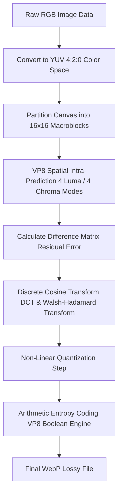
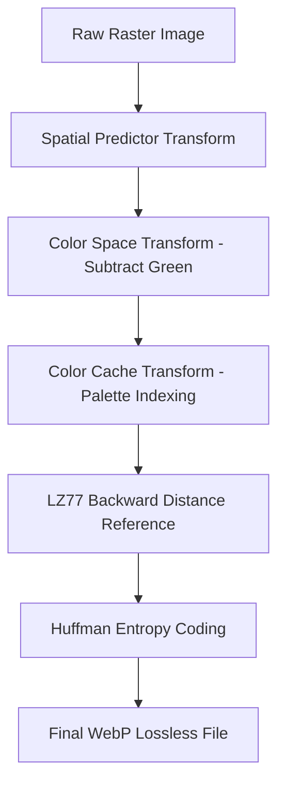

# WebP Compression Explained: The Complete Technical Guide

Image optimization is essential for modern web performance, SEO, and bandwidth management. For decades, developers relied on JPEG for photographic content and PNG for graphics requiring transparency. However, serving uncompressed or legacy image formats slows down page rendering and hurts Core Web Vitals scores.

Developed by Google in 2010, the **WebP image format** was designed to replace both JPEG and PNG with a single, highly efficient container. WebP supports lossy compression, lossless compression, alpha channel transparency, and animation—all while reducing file sizes by **25% to 35%** compared to traditional formats.

This guide analyzes how WebP compression works, details the mechanics of VP8 intra-frame prediction, explains WebP lossless spatial transformations, examines alpha transparency channel encoding, and provides step-by-step optimization settings.

---

## Technical Comparison: WebP Lossy vs. WebP Lossless vs. JPEG vs. PNG

To understand WebP's versatility, we must compare its two primary operational modes against legacy web formats:

| Feature | WebP Lossy (VP8 Engine) | WebP Lossless | JPEG (DCT Quantization) | PNG (DEFLATE / Delta) |
| :--- | :--- | :--- | :--- | :--- |
| **Codec Foundation** | **VP8 Intra-Prediction** | **Spatial Transforms + Entropy**| Discrete Cosine Transform | LZ77 + Huffman (Deflate) |
| **Relative File Size** | **25%–35% smaller than JPEG**| **26% smaller than PNG** | Baseline Standard | 100% Uncompressed Raster |
| **Alpha Transparency** | **Yes (Lossy / Lossless Alpha)**| **Yes (8-bit Alpha Channel)** | No (Solid Canvas) | Yes (8-bit Alpha Channel) |
| **Compression Mode** | Lossy (Quantized Residuals) | 100% Lossless | Lossy (Quantized DCT) | 100% Lossless |
| **Animation Support** | Yes (Animated WebP) | Yes (Animated WebP) | No | Limited (APNG) |
| **Browser Compatibility**| Universal (100% Modern) | Universal (100% Modern) | Universal (100% Legacy) | Universal (100% Legacy) |

---

## The Mathematics of WebP Lossy Compression (VP8 Engine)

WebP lossy compression is based on the keyframe (intra-frame) encoding algorithms of the **VP8 video codec**. Instead of compressing pixels independently, WebP uses spatial prediction to encode image data efficiently.



The WebP lossy compression pipeline involves several distinct mathematical processing phases:

### 1. Macroblock Partitioning
The image canvas is divided into **$16\times16$ pixel macroblocks** for luminance (brightness) data, and corresponding $8\times8$ pixel sub-blocks for chrominance (color) data.

### 2. VP8 Intra-Frame Spatial Prediction
Instead of storing raw pixel values, the VP8 engine predicts the contents of each macroblock using previously decoded pixels from the blocks directly above it and to its left. 

The encoder evaluates several prediction modes:
*   **Luma ($16\times16$) Modes:**
    *   *DC Prediction:* Fills the block with the average color of surrounding pixels.
    *   *H-Prediction (Horizontal):* Extends vertical pixel columns horizontally across the block.
    *   *V-Prediction (Vertical):* Extends horizontal pixel rows vertically down the block.
    *   *TM-Prediction (TrueMotion):* Uses a linear gradient equation based on top, left, and top-left pixels to predict diagonal shifts.
*   **Sub-Block ($4\times4$) Modes:** For complex textures, macroblocks are split into sixteen $4\times4$ sub-blocks, evaluating **10 directional prediction angles** (such as Diagonal Down-Left or Vertical-Right).

### 3. Residual Encoding & DCT Transforms
After selecting the optimal prediction mode, the encoder subtracts the predicted values from the actual pixel values to create a **Residual Error Matrix**.

The encoder then converts this residual matrix into frequency space using two mathematical transforms:
*   **DCT (Discrete Cosine Transform):** Applied to $4\times4$ sub-blocks to concentrate residual energy into high-frequency and low-frequency coefficients.
*   **WHT (Walsh-Hadamard Transform):** Applied to the DC coefficients of the $16\times16$ macroblock to compress background luminance further.

### 4. Quantization & Arithmetic Boolean Coding
The transform coefficients are divided by values from a **Quantization Table** and rounded to integer values. Finally, the quantized values and prediction vectors are encoded into a compact binary stream using VP8's **Arithmetic Boolean Entropy Engine**.

---

## The Mechanics of WebP Lossless Compression

WebP Lossless compression uses advanced spatial transformation algorithms to shrink files without discarding any pixel data, outperforming PNG by an average of **26%**:



WebP Lossless applies four reversible spatial transforms before encoding the data:

1.  **Predictor Transform:** Uses 14 spatial prediction formulas to reduce spatial entropy across rows of pixels.
2.  **Color Space Transform:** Decorrelates color channels by subtracting the green channel value from the red and blue channels ($R - G$ and $B - G$). Because green light dominates human vision, red and blue values closely track green values, making the residual color differences much smaller and easier to compress.
3.  **Color Cache Transform:** Stores frequently used colors in an indexed color cache array. When a recently used color appears again, the encoder replaces it with a short cache index code rather than storing its full RGB bytes.
4.  **Color Indexing (Palette) Transform:** If the image contains fewer than 256 unique colors, the encoder constructs a color palette map and converts pixel coordinates into 8-bit palette index codes.

Finally, the transformed pixel data is compressed using a combination of **LZ77 backward distance coding** and **Huffman entropy tables**.

---

## Encoding Alpha Transparency in WebP

Unlike JPEG (which forces a solid background color), WebP supports full **alpha channel transparency** for both lossy and lossless modes:

*   **Lossy RGB with Lossless Alpha:** For photographic subjects on a transparent background, WebP can encode the RGB image data using lossy VP8 compression while storing the alpha transparency mask using lossless WebP compression.
*   **File Size Benefit:** This hybrid approach produces transparent assets that are **60% to 80% smaller** than transparent PNGs, making it an ideal choice for e-commerce product shots and floating UI graphics.

---

## Step-by-Step WebP Export Workflow with Command Line Tools

You can convert images to WebP using Google's official `cwebp` command line utility:

### 1. Converting JPEGs to Lossy WebP (Quality 80%):
```bash
# Convert photo.jpg to photo.webp with quality 80
cwebp -q 80 photo.jpg -o photo.webp
```

### 2. Converting Transparent PNGs to Lossless WebP:
```bash
# Convert graphic.png to lossless graphic.webp with maximum compression effort (m 6)
cwebp -lossless -m 6 graphic.png -o graphic.webp
```

### 3. Converting Directory Batches with ImageMagick:
```bash
# Batch convert all JPEGs in a directory to WebP
magick mogrify -format webp -quality 82 *.jpg
```

---

## Implementing WebP with Legacy JPEG/PNG Fallbacks

While WebP is supported by all modern browsers (Chrome, Safari, Firefox, Edge, iOS Safari), you should still provide fallback strategies for legacy environments using the HTML5 `<picture>` element:

```html
<picture>
  <!-- Modern Browser Choice: WebP -->
  <source srcset="/images/product-card.webp" type="image/webp">
  
  <!-- Legacy Fallback: Standard JPG -->
  
</picture>
```

---

## Step-by-Step WebP Optimization Checklist

Before deploying WebP assets across your website, run your images through this checklist:

*   **Format Selection:** Export photos as **lossy WebP** (quality 80-85%). Export text-heavy graphics, logos, and screenshots as **lossless WebP**.
*   **Dimensions:** Scale images to their exact display dimensions before converting to prevent data transfer bloat.
*   **Layout Reservation:** Always declare `width` and `height` attributes on the fallback `` tag to reserve layout space and prevent Cumulative Layout Shift (CLS).
*   **Asset Compression:** Use our free, browser-based [Image Compressor](/tools/image-compressor) to reduce file sizes locally before uploading.

---

## Frequently Asked Questions

### What is the WebP image format?
WebP is a modern web image format developed by Google. It supports lossy compression, lossless compression, alpha transparency, and animation, producing files that are 25% to 35% smaller than JPEG and PNG.

### How does WebP lossy compression work?
WebP lossy compression uses VP8 video keyframe technology. It predicts macroblock pixel values using neighboring pixels, encoding only the difference (residual error) using Discrete Cosine Transforms (DCT) and arithmetic entropy coding.

### Does WebP support transparency?
Yes. WebP supports full 8-bit alpha transparency for both lossy and lossless modes. This produces transparent images that are significantly smaller than equivalent PNG files.

### Is WebP lossless better than PNG?
Yes. WebP lossless compression algorithms reduce file sizes by an average of **26% compared to PNG**, while preserving 100% of the original pixel detail.

### What is the recommended compression quality setting for WebP?
For lossy WebP images, a quality setting between **80% and 85%** provides an optimal balance, reducing file sizes by up to 80% with no noticeable loss in visual quality.

### How can I convert PNGs to WebP securely?
To convert PNGs or JPEGs to WebP without exposing assets to third-party databases, use our free, browser-based [Image Converter](/image-converter). The tool runs locally in your browser, keeping your files private and secure.
