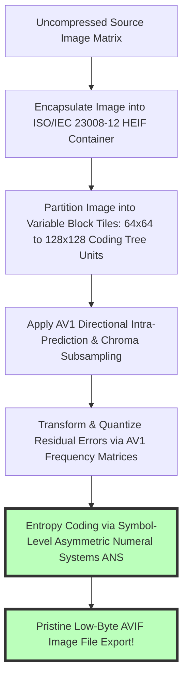
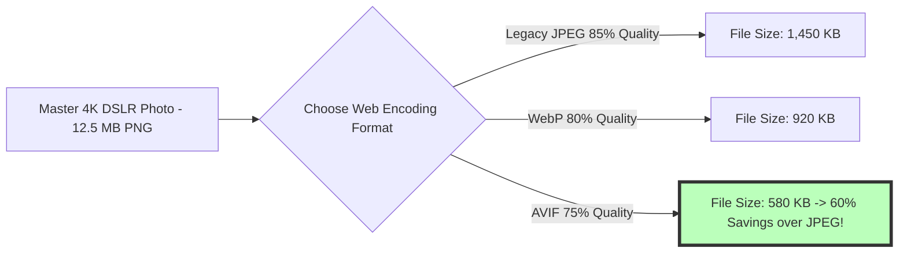

# What is AVIF? Modern Web Image Compression & WebP vs AVIF Guide

In modern web development, page load speed, mobile responsiveness, and visual optimization directly determine Google search engine rankings, Core Web Vitals compliance (Largest Contentful Paint - LCP), and user conversion rates. For decades, websites relied on legacy image formats developed in the 1990s—such as **JPEG (1992)** and **PNG (1996)**—which consume excessive network bandwidth, lack modern High Dynamic Range (HDR) color depth support, and produce visible compression artifacts at low bitrates.

While Google's **WebP (2010)** represented a major leap forward, web performance engineering reached a new pinnacle with the release of **AVIF (AV1 Image File Format)**. Standardized by the Alliance for Open Media (AOMedia)—a non-profit consortium backed by Google, Mozilla, Apple, Microsoft, Amazon, Netflix, and Meta—AVIF is an open, royalty-free image format based on the revolutionary **AV1 video codec**.

AVIF delivers **20% to 50% smaller file sizes than WebP** and up to **80% smaller payloads than legacy JPEG** at equivalent or superior visual quality. It supports 10-bit and 12-bit High Dynamic Range (HDR), Wide Color Gamut (WCG - Rec. 2020), full alpha channel transparency, lossy and lossless compression, and animated image sequences.

This guide provides a comprehensive technical breakdown of **what AVIF is**, details **AV1 intra-frame coding mechanics**, compares **AVIF vs WebP vs JPEG**, outlines browser support history, and demonstrates how to implement responsive `<picture>` fallback tags in modern web applications.

---

## Master Comparison Matrix: AVIF vs. WebP vs. Legacy JPEG & PNG

To understand why AVIF is the ultimate image format for web performance, review this technical specification matrix:

| Feature / Metric | AVIF (AV1 Codec) | WebP (VP8 Codec) | Legacy JPEG (1992) | PNG-24 (1996) |
| :--- | :--- | :--- | :--- | :--- |
| **Compression Standard**| **AV1 Video Intra-Frame** | VP8 Video Intra-Frame | Discrete Cosine (DCT) | Lossless Deflate / zlib |
| **Relative File Size** | **Smallest (30% < WebP)** | Medium (30% < JPEG) | Large Baseline | Massive (Uncompressed)|
| **Bit Depth / HDR** | **8, 10, 12-Bit HDR (Rec.2020)**| 8-Bit SDR (sRGB) | 8-Bit SDR (sRGB) | 8, 16-Bit SDR |
| **Alpha Transparency** | **YES (8 to 12-Bit Alpha)** | YES (8-Bit Alpha) | ❌ No | YES (8-Bit Alpha) |
| **Lossless Compression**| **YES (Lossless AV1)** | **YES (Lossless WebP)** | ❌ No | **YES (100% Lossless)** |
| **Global Browser Support**| **95%+ (Chrome, Safari, Firefox, Edge)**| **98%+ Universal** | **100% Universal** | **100% Universal** |
| **Encoding Speed** | **Slower (High CPU Math)** | Fast | Extremely Fast | Fast |

---

## Technical Mechanics: AV1 Intra-Frame Compression & HEIF Containers

How does AVIF achieve unprecedented compression savings without sacrificing fine visual detail?



### 1. Variable Superblock Partitioning ($128\times128\text{px}$)
Unlike legacy JPEG which forces rigid $8\times8$ pixel grids, the AV1 codec divides images into flexible Coding Tree Units (CTUs) ranging from $4\times4$ up to $128\times128$ superblocks. Smooth background skies use large $128\times128$ blocks to minimize overhead, while detailed foreground textures adaptively subdivide into smaller micro-blocks.

### 2. 10-Bit and 12-Bit High Dynamic Range (HDR) Color Gamut
Standard WebP and JPEG are limited to 8-bit color depth (256 shades per channel = 16.7 million colors), causing color banding in smooth gradients. AVIF supports **10-bit and 12-bit color depth** (up to 68 billion colors) alongside **Rec. 2020 wide color gamut**, enabling vibrant HDR displays on OLED smartphone screens.

---

## Performance Benchmark: WebP vs. AVIF Web Delivery

Evaluating network payload sizes across real-world web assets illustrates AVIF's efficiency:



* **Core Web Vitals Impact:** Serving AVIF images reduces Largest Contentful Paint (LCP) network download times by up to **400 milliseconds** on mobile 4G networks, directly improving Google PageSpeed Insights performance scores.

---

## Responsive HTML Implementation: `<picture>` Element Fallback Strategy

Because legacy browsers (such as Internet Explorer or older Safari iOS 15 builds) lack AVIF decoding, modern websites use the HTML5 `<picture>` element to serve progressive fallbacks:

```html
<picture>
  <!-- Serve AVIF to modern browsers (95%+ global support) -->
  <source srcset="hero-image.avif" type="image/avif">
  
  <!-- Fallback to WebP for older mobile browsers -->
  <source srcset="hero-image.webp" type="image/webp">
  
  <!-- Ultimate legacy fallback for ancient browsers -->
  
</picture>
```

---

## Step-by-Step Tutorial: How to Convert Images to AVIF for Free

Follow this simple tutorial to convert photos to AVIF locally in your browser using our free tool:

### Step 1: Upload Source Photo
Drag and drop your high-definition DSLR photos, PNG graphics, or WebP files into our free client-side [AVIF Converter](/tools/avif-to-jpg).

### Step 2: Select AVIF Compression Quality
Set compression quality between **65% and 75%** for the optimal mathematical balance between tiny file size payload and crisp visual clarity.

### Step 3: Choose Bit Depth & Encoding Effort
Select **10-Bit Color Depth** for HDR graphics or leave standard 8-bit SDR color space enabled. Set encoding CPU effort level to `4` or `5`.

### Step 4: Process and Download AVIF Asset
Click "Convert to AVIF". The browser decodes and encodes the image locally inside browser RAM via compiled WebAssembly, exporting your compressed AVIF asset instantly without cloud server delays.

---

## Step-by-Step AVIF Image Optimization Quality Checklist

Before deploying AVIF images across production websites, verify your assets against this quality checklist:

* **HTML `<picture>` Progressive Fallback Tag Verification:** Confirm `<picture>` wrapper tags include WebP and JPEG fallbacks for legacy browsers.
* **Explicit Aspect Ratio & Pixel Dimensions:** Verify `width` and `height` attributes are defined explicitly on `` tags to prevent Cumulative Layout Shift (CLS) web page jumps.
* **Target Quality Parameter Tuning (65-75%):** Avoid encoding AVIF above 85% quality, as high bitrates diminish file compression savings without visual gain.
* **Zero Server Upload Privacy Verification:** Confirm format conversion occurred 100% locally in browser RAM without remote cloud server exposure.

---

## AV1 Chroma Subsampling Modes (YUV 4:4:4 vs. YUV 4:2:0)

AVIF encoding supports customizable YUV color space sub-sampling configurations:
* **YUV 4:4:4 Full Chroma:** Preserves 100% color resolution without sub-sampling. Essential for text graphics, UI screenshots, and vector illustrations where red-on-black text requires sharp pixel borders.
* **YUV 4:2:0 Standard Sub-sampling:** Reduces color data bandwidth by 50%. Ideal for complex photographic scenes, natural portraits, and landscape backgrounds where human eyes cannot detect subtle color reductions.

---

## Animated AVIFS Sequence Specification (Replacing Legacy GIFs)

Beyond static photographs, AVIF supports multi-frame animated sequences (`.avifs`):
* **90% Smaller than Animated GIFs:** Animated AVIF sequences replace bloated 15MB GIF animations with crisp 1.2MB files containing full 24-bit color depth, smooth motion interpolation, and variable frame delays.
* **HDR Animation Support:** Supports animated HDR graphics with alpha channel transparency for modern web application micro-interactions.

---

## Frequently Asked Questions

### What does AVIF stand for?
AVIF stands for **AV1 Image File Format**. It is a modern, open-source, royalty-free image format based on the AV1 video compression codec contained within ISO/IEC 23008-12 HEIF files.

### Is AVIF better than WebP?
Yes. AVIF generally delivers **20% to 30% smaller file sizes than WebP** at equivalent visual quality, supports 10-bit/12-bit HDR wide color gamuts (Rec. 2020), and handles complex gradients without color banding.

### What browsers support AVIF in 2026?
As of 2026, **over 95% of active global web browsers support AVIF natively**, including Google Chrome (v85+), Mozilla Firefox (v93+), Apple Safari (iOS 16+ / macOS Ventura+), and Microsoft Edge (v121+).

### Does AVIF support alpha transparency and lossless compression?
Yes. AVIF supports **full 8-bit to 12-bit alpha channel transparency** for graphic cutouts, as well as 100% mathematically lossless compression for vector graphics and line art.

### Why is AVIF encoding slower than JPEG or WebP?
AVIF uses advanced AV1 video codec algorithms (such as variable $128\times128$ superblocks and complex intra-prediction math) that require significantly more CPU processing power to encode than legacy JPEG.

### Is my image uploaded to a server when converting to AVIF on this site?
No. All decoding, AV1 matrix encoding, WebAssembly processing, and binary file generation happen **100% inside your local web browser RAM**. Your images never leave your device.
