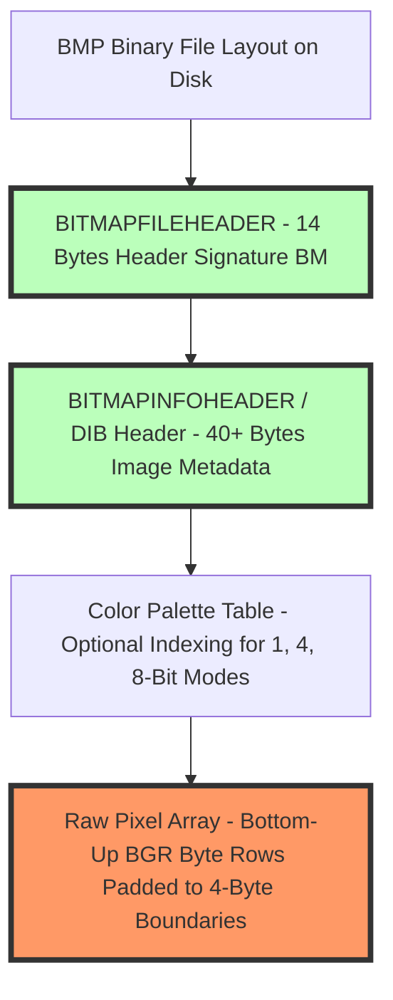

# What is BMP? Uncompressed Bitmap Format & Header Structure Guide

The **BMP (Bitmap Image File)** format is one of the oldest, simplest, and most foundational raster graphics file formats in computing history. Developed by Microsoft and IBM in 1990 alongside the release of **Windows 3.0**, the BMP specification was created to establish a standard **Device-Independent Bitmap (DIB)** format capable of storing digital images across different display hardware devices without requiring specialized display driver color translation.

Unlike modern web formats like WebP, AVIF, or JPEG that employ complex lossy or lossless compression algorithms (such as Discrete Cosine Transform or Discrete Wavelet Transform), a standard BMP file stores **raw, uncompressed pixel color arrays**. Every pixel's Red, Green, Blue (RGB), and optional Alpha (RGBA) byte channels are written directly to disk in sequential order.

While this lack of compression guarantees **100% perfect visual fidelity** with zero mathematical data loss, it results in **massive file sizes**—making raw BMP images completely unsuited for modern web page publishing. However, BMP remains vital in low-level graphics programming, embedded system firmware, industrial imaging, C/C++ game engines, and Windows desktop operating system internals.

This guide provides a comprehensive technical breakdown of **what BMP is**, details **DIB binary file header anatomy**, explains **1-bit to 32-bit color depth indexing**, compares **BMP vs PNG vs WebP**, and demonstrates how to convert legacy BMP files to modern web formats locally in your browser.

---

## Master Comparison Matrix: BMP vs. PNG vs. WebP & JPEG

To understand how legacy uncompressed BMP compares to modern compressed image standards, review this specification matrix:

| Technical Feature / Metric | BMP (Bitmap / DIB) | PNG (Portable Network) | WebP (Next-Gen Web) | JPEG (Legacy Photo) |
| :--- | :--- | :--- | :--- | :--- |
| **Compression Standard**| **Uncompressed (Raw Bytes)**| Lossless Deflate/zlib | Lossy / Lossless VP8 | Lossy DCT Quantization |
| **Data Loss / Fidelity** | **100% Zero Loss (Raw)** | **100% Lossless** | Lossless or Lossy | Lossy (Quantized AC) |
| **File Size Payload** | **Massive (e.g. 24MB for 4K)**| Medium-Small | **Tiny (80% < BMP)** | Small |
| **Color Depths Supported**| **1, 4, 8, 16, 24, 32-Bit**| **1, 2, 4, 8, 16, 24, 32-Bit**| **8-Bit per Channel** | **8-Bit per Channel** |
| **Alpha Channel Support** | **YES (32-Bit RGBA)** | **YES (32-Bit RGBA)** | **YES (8-Bit Alpha)** | ❌ No |
| **Primary Industry Use** | **Windows OS / Embedded C** | **Web Vector Art / Logos** | **Modern Web Publishing**| **Consumer Digital Photos**|
| **Web Browser Support** | ❌ Poor / Deprecated | **100% Universal** | **98%+ Universal** | **100% Universal** |

---

## Technical Anatomy: BMP Binary File Header Structure (`BITMAPFILEHEADER`)

How is a `.bmp` binary file structured on disk from the opening 14-byte signature to the raw pixel data array?



### 1. The 14-Byte `BITMAPFILEHEADER` Struct
Every BMP file begins with a mandatory 14-byte binary header containing magic signature bytes and byte offsets:

```c
typedef struct {
    uint16_t bfType;      // Magic bytes: 0x4D42 ("BM" in ASCII)
    uint32_t bfSize;      // Total size of the BMP file in bytes
    uint16_t bfReserved1; // Reserved (must be 0)
    uint16_t bfReserved2; // Reserved (must be 0)
    uint32_t bfOffBits;   // Byte offset from start of file to raw pixel data
} BITMAPFILEHEADER;
```

### 2. The 40-Byte `BITMAPINFOHEADER` (DIB Metadata)
Following the file header is the DIB information header specifying pixel dimensions, color depth, and compression flags:
* **`biWidth` & `biHeight`:** Pixel width and height. If `biHeight` is positive, pixels are stored **bottom-to-top** (upside down); if negative, top-to-bottom.
* **`biBitCount`:** Bits per pixel (1, 4, 8, 16, 24, or 32-bit).
* **`biCompression`:** Compression flag (`0 = BI_RGB` uncompressed, `1 = BI_RLE8`, `2 = BI_RLE4`).

### 3. Pixel Array Row Padding Math (4-Byte Alignment)
In BMP files, every horizontal row of pixels must be padded to a multiple of **4 bytes** (32 bits) in memory.
$$\text{Row Size (Bytes)} = \left\lfloor \frac{\text{Width} \times \text{BitsPerPixel} + 31}{32} \right\rfloor \times 4$$

* If a $24$-bit image is $5$ pixels wide, each row requires $5 \times 3 = 15$ bytes. To satisfy 4-byte alignment, 1 padding byte ($0x00$) is appended to the end of each row.

---

## Color Depth Variations: 1-Bit Monochrome to 32-Bit RGBA

BMP supports multiple color depth modes depending on memory constraints:

* **1-Bit Monochrome:** Stores binary black-and-white graphics using a 2-color palette table ($1\text{ bit per pixel}$).
* **8-Bit Palette Indexed:** Uses an array of color indices referencing a 256-color palette lookup table ($8\text{ bits per pixel}$).
* **24-Bit TrueColor (RGB):** Stores 8 bits for Blue, 8 bits for Green, and 8 bits for Red ($24\text{ bits per pixel} = 16.7\text{ million colors}$). Note that BMP stores color channels in **BGR order** rather than RGB.
* **32-Bit TrueColor + Alpha (RGBA):** Includes an additional 8-bit Alpha channel ($32\text{ bits per pixel}$) for transparency.

---

## Step-by-Step Tutorial: How to Convert BMP Images to WebP for Free

Because BMP files consume massive bandwidth (a single $1920\times1080$ BMP is 6.2 MB), converting BMP to WebP reduces file size by **95%+**:

### Step 1: Upload Source BMP File
Drag and drop your `.bmp` or `.dib` file into our free [PNG to JPG Converter](/tools/png-to-jpg) or [AVIF Converter](/tools/avif-to-jpg).

### Step 2: Select Web Target Format (WebP or PNG)
Select **WebP** for maximum compression savings or **PNG** for 100% lossless vector preservation.

### Step 3: Adjust Quality & Compression Settings
Set quality between **80% and 85%** to reduce file size from 6.2 MB down to under 250 KB.

### Step 4: Convert and Download File
Click "Convert & Download". The browser parses the binary BMP file header and pixel array locally in RAM via WebAssembly, exporting your modern WebP image instantly.

---

## Step-by-Step BMP File Optimization Quality Checklist

Before working with BMP graphics in software development projects, verify your files against this quality checklist:

* **Web Conversion Requirement:** Never embed raw `.bmp` files directly inside public web pages; convert to WebP or AVIF.
* **Header Magic Bytes Check:** Confirm binary files begin with magic ASCII bytes `0x4D42` (`"BM"`).
* **4-Byte Row Padding Alignment:** Ensure custom C/C++ parser scripts account for 4-byte row padding.
* **Local Processing Check:** Confirm format conversion occurred 100% locally in browser RAM without server uploads.

---

## Run-Length Encoding (RLE4 / RLE8) Compression Modes

While standard BMP files store raw uncompressed bytes (`BI_RGB = 0`), the specification supports optional lossless Run-Length Encoding (RLE):
* **RLE8 Compression (`BI_RLE8 = 1`):** Compresses indexed 8-bit (256-color) images by replacing repeating horizontal sequences of identical color bytes with 2-byte run-length pairs (e.g. `12 05` = 12 consecutive pixels of color index 5).
* **RLE4 Compression (`BI_RLE4 = 2`):** Compresses indexed 4-bit (16-color) graphics using nibble pairs. Ideal for simple computer icons and line drawings.

---

## DIB Header Specification Evolution (`BITMAPV4HEADER` & `BITMAPV5HEADER`)

As display technology evolved from 1990 to Windows 98 and 2000, Microsoft expanded the DIB header structure:
* **`BITMAPV4HEADER` (108 Bytes):** Added support for RGB color spaces, gamma correction curves, and 32-bit RGBA bitmask fields.
* **`BITMAPV5HEADER` (124 Bytes):** Introduced full ICC Color Profile embedding, sRGB gamut management, and high-dynamic rendering attributes for professional publishing.

---

## Frequently Asked Questions

### What does BMP stand for?
BMP stands for **Bitmap Image File**. It is a standard raster graphics image file format introduced by Microsoft and IBM in 1990 for storing Device-Independent Bitmaps (DIB) on Windows operating systems.

### Why are BMP files so large?
BMP files are large because they store **raw, uncompressed pixel color data**. Unlike JPEG or WebP, BMP does not compress pixel data, writing every pixel's full RGB byte values directly to disk.

### Can I use BMP files on a website?
While modern web browsers can display BMP files, **you should never use BMP on a website**. A single HD BMP image can exceed 6 megabytes, causing severe page load delays and failing Google Core Web Vitals audit checks.

### What is the difference between BMP and PNG?
Both BMP and PNG preserve 100% image quality without data loss. However, **PNG uses zlib/Deflate lossless compression** to shrink file sizes by 60% to 80% compared to raw uncompressed BMP.

### How do I open or convert a BMP file on Mac or Windows?
You can open BMP files natively using Paint (Windows) or Preview (Mac). To convert BMP to WebP or JPEG for web use, drag your file into our free client-side converter.

### Is my image uploaded to a server when converting BMP on this site?
No. All binary header parsing, DIB memory array reading, WebAssembly transcoding, and WebP encoding happen **100% inside your local web browser RAM**. Your files never leave your computer.
