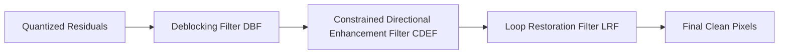

# AVIF File Format Standard: AV1 Video Codec & Next-Gen Graphics

The **AV1 Image File Format (AVIF)** is a next-generation web graphics standard developed by the Alliance for Open Media (AOMedia). Formalized in 2019 under the **ISO/IEC 23000-22** specification, AVIF wraps static frames and animated sequences compressed with the royalty-free AV1 video codec inside the standard ISO Base Media File Format (ISOBMFF) container. 

This specification document outlines the low-level **AV1 keyframe bitstream structure**, the **chrominance subsampling math**, **in-loop enhancement filters**, and visual optimization guidelines.

---

## What is the AVIF File Format Specification?

AVIF is designed to replace JPEG, WebP, and PNG by offering superior compression efficiency. By using the advanced video coding tools of the AV1 codec, AVIF files are typically:
*   **50% smaller** than JPEG at equivalent quality.
*   **20% smaller** than WebP at equivalent quality.
*   **80% smaller** than PNG for photographic contents requiring alpha transparency.

Beyond size savings, the AVIF standard supports **HDR (High Dynamic Range)** colors with up to 12-bit color depth, monochrome profiles, and lossless compression modes.

---

## The AVIF Container Structure & Open Bitstream Units (OBUs)

An AVIF file is an ISOBMFF container (similar to HEIC) that stores compressed image frames as **items**. The actual compressed pixel payload is packaged into a sequence of **Open Bitstream Units (OBUs)**:

```
+-----------------------------------------------------------+
| ISOBMFF Wrapper (ftyp: 'avif', meta, iprp, iloc)           |
+-----------------------------------------------------------+
| OBU Stream (Media Payload inside 'mdat' box)              |
|  +-- Sequence Header OBU (Color profile, bit depth)        |
|  +-- Metadata OBU (EXIF, XMP profiles)                     |
|  +-- Frame Header OBU (Quantization parameters, sizing)     |
|  +-- Tile Group / Pixel Data OBU (Bitstream)               |
+-----------------------------------------------------------+
```

### Core OBU Types in AVIF
Every OBU begins with a standardized header that defines the unit type and size. The primary OBUs required to decode an AVIF image are:
*   **Sequence Header OBU:** Defines parameters that apply to the entire file, such as image dimensions, color depth (8, 10, or 12 bits), chroma subsampling layout, and color primaries.
*   **Frame Header OBU:** Contains frame-specific decoding parameters, including quantization tables, loop filter configurations, and tile geometry.
*   **Tile Group / Temporal Unit OBU:** Stores the actual compressed entropy bitstream of the image tiles.
*   **Metadata OBU:** Stores non-image metadata, such as EXIF and XMP tags.

---

## The AV1 Keyframe Decoding Pipeline

AVIF compresses images using the intra-frame coding tools of the AV1 codec. Rather than dividing images into fixed blocks, AV1 uses a highly flexible block-slicing system.

### 1. Superblocks and Partitioning
AV1 divides images into large areas called **superblocks** (either $128\times128$ or $64\times64$ pixels). Each superblock can be recursively split into smaller coding blocks using a quadtree structure, supporting block sizes down to $4\times4$ pixels. 

This allows the encoder to use large blocks for uniform areas (like skies) and small blocks for detailed textures, maximizing compression efficiency.

### 2. Directional Intra-Prediction Modes
To predict pixel values, AV1 uses **56 directional intra-prediction modes** (compared to JPEG's none and WebP's 4). These modes project neighboring pixel values along exact angles to predict color gradients and edges. It also features:
*   **Paeth Predictor:** Predicts pixels based on horizontal, vertical, and diagonal patterns.
*   **Recursive Filtering:** Predicts pixels using statistical analysis of nearby blocks.
*   **Palette Mode:** Uses an indexed color palette for blocks with few colors, like icons or text.

### 3. In-Loop Enhancement Filters
To clean up compression noise and blocky edges, AV1 applies three filters in sequence during decoding:



*   **Deblocking Filter (DBF):** Smooths grid-like artifacts at block boundaries.
*   **CDEF (Constrained Directional Enhancement Filter):** Detects directional edges and applies adaptive filters along those angles to remove ringing noise and blur.
*   **Loop Restoration Filter (LRF):** Applies mathematical corrections to restore fine details that were lost during quantization.

---

## AV1 Tile Slicing and Multi-Threaded Decoding

A key performance feature of the AV1 codec is its native support for **Tile Slicing**.
*   **The Problem:** High-resolution images (such as 8K photos or dense medical graphics) require significant processing power to decode. For legacy formats, decoding must be done in a single serial thread, which can cause frame lag, rendering delays, or high battery drain on mobile devices.
*   **The Solution:** The AV1 standard allows an image to be sliced into a grid of independent **Tiles**. Each tile is compressed as an independent bitstream with its own entropy coding context. During decoding, these tiles can be processed in parallel across multiple CPU threads. By distributing the decoding workload across multiple processor cores, AVIF reduces rendering times for high-resolution graphics and optimizes power consumption on modern mobile hardware. This parallel decoding model makes AVIF highly scalable for future ultra-high-resolution display standards.

---

## YUV Color Spacing & High Dynamic Range (HDR) Support

While JPEGs are typically limited to 8-bit sRGB color, AVIF supports wide color gamuts and high-bit-depth profiles.

### 1. Chrominance Subsampling Modes
AVIF maps RGB pixels into the **YUV color space**, where **Y** represents luminance (brightness) and **U/V** represent chrominance (color). Because the human eye is more sensitive to brightness than color details, the color channels can be compressed at lower resolutions:
*   **YUV 4:2:0:** Color channels are compressed to half-resolution both horizontally and vertically, offering the smallest file sizes (standard for web images).
*   **YUV 4:2:2:** Color channels are compressed to half-resolution horizontally but remain full-resolution vertically.
*   **YUV 4:4:4:** Color channels remain at full resolution, preserving sharp color borders without any color bleeding (ideal for pixel art, logos, and graphics).

### 2. High Dynamic Range (HDR) Color Depth & Transfer Functions
AVIF supports **10-bit and 12-bit color depths** which are essential for displaying High Dynamic Range (HDR) content. 
*   **8-bit (Standard JPEG):** Supports 256 color values per channel (16.7 million total colors), which can cause visible color banding in smooth gradients.
*   **10-bit & 12-bit (AVIF):** Supports up to 4,096 color values per channel (68 billion total colors). 
*   **HDR Transfer Functions:** AVIF supports advanced electro-optical transfer functions (EOTF) such as **Perceptual Quantizer (PQ, SMPTE ST 2084)** and **Hybrid Log-Gamma (HLG)**. These functions allow the format to map luminance values up to 10,000 nits, preserving peak highlights and shadow details on modern HDR-compatible televisions, mobile screens, and laptops.

---

## Compression Performance: AVIF vs. WebP vs. JPEG

Here is how AVIF compares to WebP and JPEG when compressing photographic content:

| Feature | AVIF | WebP | JPEG |
| :--- | :---: | :---: | :---: |
| **Max Color Depth** | **12-Bit** | 8-Bit | 8-Bit |
| **Compression Method** | **Lossy & Lossless** | Lossy & Lossless | Lossy Only |
| **Transparency (Alpha)** | **Yes** | Yes | No |
| **Avg. File Size (100% Quality)** | **20 KB** | 28 KB | 45 KB |
| **Banding Resistance** | **High (10-bit/12-bit)** | Low (8-bit) | Low (8-bit) |
| **Browser Compatibility** | **93%+ (Modern Browsers)** | 98%+ | 100% |

---

## Frequently Asked Questions About the AVIF Standard

### What is an AVIF file?
An AVIF (AV1 Image File Format) file is a next-generation web image format developed by AOMedia. It uses the highly efficient AV1 video codec to compress static images and animations, wrapping the data inside an ISO Base Media container to reduce file sizes by up to 50% compared to JPEG.

### What is an OBU in AVIF?
An OBU (Open Bitstream Unit) is a structured data block used by the AV1 codec. Every AVIF image is stored as a sequence of OBUs, including Sequence Headers (defining dimensions and color depth), Frame Headers (defining filter and tile parameters), and Tile Groups (storing the compressed pixels).

### Is AVIF better than WebP?
Yes, AVIF generally offers **20% to 30% better compression** than WebP at equivalent visual quality. It also supports 10-bit and 12-bit High Dynamic Range (HDR) color, whereas WebP is limited to 8-bit standard color.

### Does AVIF support transparency?
Yes. AVIF supports alpha-channel transparency. It stores transparency data as a separate auxiliary image item in the container, which is compressed using a grayscale AV1 bitstream to ensure clean, sharp transparency edges.

### How do loop filters improve AVIF quality?
AVIF applies three filters during decoding: a Deblocking Filter to smooth block edges, a Constrained Directional Enhancement Filter (CDEF) to remove ringing artifacts along diagonal lines, and a Loop Restoration Filter (LRF) to restore fine textures and details lost during compression.

### How can I convert AVIF to JPG?
Because AVIF is a modern format, older software or legacy websites may not support it. To convert AVIF files back to compatible formats like JPEG or PNG without uploading them to a third-party server, use our browser-based [AVIF to PNG Converter](/tools/avif-to-png) or [AVIF to JPG Converter](/tools/avif-to-jpg).