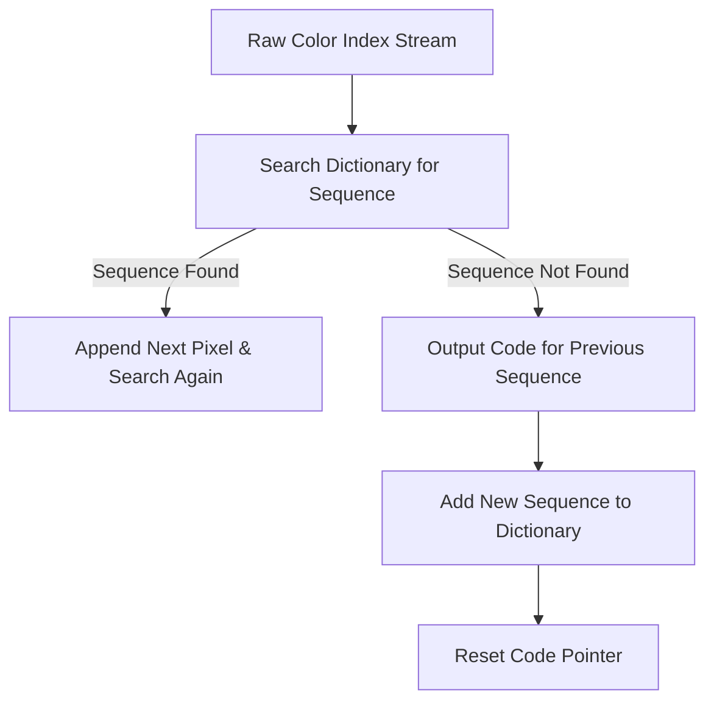

# GIF File Format Standard: LZW Compression & Animation Block Layout

The **Graphics Interchange Format (GIF)** is a legacy, palette-based raster graphics format developed by CompuServe in 1987. Formalized under the popular **GIF89a** specification, the format is widely known for introducing multi-frame animations and simple 1-bit transparency transparency on the web. GIF uses the LZW (Lempel-Ziv-Welch) compression algorithm to store images with up to 8 bits per pixel (supporting a maximum of 256 unique colors).

This specification document outlines the low-level **GIF89a block container layout**, the **LZW compression dictionary mechanics**, **Graphic Control Extension (GCE) animation headers**, and format optimization guidelines.

---

## What is the GIF File Format Specification?

The GIF specification defines a byte stream format designed to transmit graphics across early networks. Because it was developed during an era of limited bandwidth, it uses a **indexed color palette** to limit file size.

Key properties of the GIF standard include:
*   **Palette Constraints:** Every frame is limited to a maximum of 256 colors chosen from a 24-bit RGB space.
*   **Lossless Compression:** Uses LZW compression to compress pixel patterns losslessly.
*   **Graphic Extensions:** Supports multi-frame animations with frame delay settings, disposal options, and 1-bit transparency.

---

## GIF87a vs. GIF89a Specifications

CompuServe released two versions of the GIF standard:
1.  **GIF87a (Original Version):** Supported basic single-frame graphics, logical screen layouts, global color tables, and interlaced scanlines.
2.  **GIF89a (Extended Version):** Added support for **Graphic Control Extensions** (enabling animated delay times and transparent color indices), Application Extensions (enabling loop counts), and plain-text overlays. Modern web utilities use the GIF89a standard exclusively.

---

## GIF89a Block Container Layout & Header Structure

A valid GIF stream is built from a sequence of structured **data blocks**. Every block begins with a specific marker byte (sentinel) and is followed by size and payload parameters:

```
+-----------------------------------------------------------+
| Header (6 bytes: 'GIF89a')                                 |
+-----------------------------------------------------------+
| Logical Screen Descriptor (7 bytes: Width, Height, Flags)  |
+-----------------------------------------------------------+
| Global Color Table (Optional: 3 bytes per RGB color)       |
+-----------------------------------------------------------+
| Graphic Control Extension (Optional: Delay, Disposal, Trans)|
+-----------------------------------------------------------+
| Image Descriptor & Local Pixel Data (LZW Sub-blocks)      |
+-----------------------------------------------------------+
| Trailer (1 byte: 0x3B File Terminator)                    |
+-----------------------------------------------------------+
```

### Core Bytes of the GIF Container
*   **Header (6 bytes):** Consists of a 3-byte signature `'GIF'` and a 3-byte version code `'89a'` (or `'87a'`).
*   **Logical Screen Descriptor (7 bytes):** Defines the global width and height of the rendering area. It also contains flags indicating the presence and size of the Global Color Table, the background color index, and the pixel aspect ratio.
*   **Global Color Table (GCT):** A list of up to 256 RGB triplets defining the shared color palette for all frames. If a frame needs a custom palette, it can contain its own **Local Color Table (LCT)**.
*   **Image Descriptor (9 bytes):** Marks the start of a frame. It specifies the coordinates (left/top offsets) and dimensions (width/height) of the frame relative to the logical screen.
*   **Trailer (1 byte):** A single byte with the value `0x3B` (semicolon) that marks the end of the GIF stream.

---

## Color Quantization & Dithering Algorithms

Because the GIF format is strictly limited to 256 colors, converting a truecolor image (like a 24-bit JPEG containing thousands of unique colors) into a GIF requires **Color Quantization** and **Dithering**.

### 1. Color Quantization
Color quantization is the process of selecting the 256 colors that best represent the original image. Encoders use clustering algorithms, such as the **Median Cut Algorithm** or **Octree Quantization**, to group similar colors together and select a representative palette.

### 2. Dithering (Floyd-Steinberg Algorithm)
Reducing color depth can cause visible color banding in smooth gradients (like skies or shadows). To prevent this, encoders use **Dithering** to mix pixels of different colors, creating the illusion of smooth gradients. 

The most common method is the **Floyd-Steinberg Dithering Algorithm**. It works by calculating the color error (the difference between the original pixel and the quantized palette color) and diffusing (distributing) that error to neighboring pixels:
$$\text{Error Diffusion Pattern:}$$
$$\begin{array}{cccccc}
& & \ast & \longrightarrow & \frac{7}{16} \\
\frac{3}{16} & \longleftarrow & \frac{5}{16} & \longleftarrow & \frac{1}{16}
\end{array}$$
*   **Right pixel:** receives $\frac{7}{16}$ of the error.
*   **Bottom-left pixel:** receives $\frac{3}{16}$ of the error.
*   **Bottom-center pixel:** receives $\frac{5}{16}$ of the error.
*   **Bottom-right pixel:** receives $\frac{1}{16}$ of the error.

While dithering prevents color banding, it adds visual noise to the image, which makes LZW compression less efficient and increases the file size.

---

## The LZW Compression Algorithm

GIF compresses pixel data using **Lempel-Ziv-Welch (LZW)** compression, a lossless, dictionary-based compression algorithm. LZW works by building a translation dictionary of color sequences as it reads the image.



### 1. Dictionary Initialization
Before compressing, the dictionary is initialized with codes representing the individual palette colors (e.g., codes `0` to `255` for a 256-color palette), plus two special control codes:
*   **Clear Code (value 256):** Resets the dictionary to its initial state when it becomes full (reaches 4,096 entries).
*   **End-of-Information Code (value 257):** Marks the end of the compressed pixel data.

### 2. Stream Reading and String Matching
The encoder reads pixel indices one by one:
1.  It searches the dictionary for the longest color index sequence ($S$) that matches the input.
2.  If the sequence is found, the encoder reads the next pixel ($K$) and checks if the extended sequence ($S+K$) exists in the dictionary.
3.  If ($S+K$) is not in the dictionary, the encoder outputs the code for the existing sequence ($S$) to the file, and adds ($S+K$) to the dictionary with a new code.
4.  The encoder resets the sequence pointer to $K$ and repeats the process.

This dictionary system is highly effective at compressing images with flat areas of solid color, reducing file sizes without losing any pixel details.

---

## Graphic Control Extensions (GCE) & Animated GIFs

Multi-frame animations are implemented in the GIF89a standard using **Graphic Control Extensions (GCE)**. A GCE block must appear directly before the frame's Image Descriptor and defines how that frame should be rendered:

*   **Disposal Method (3 bits):** Tells the renderer what to do with the current frame after its delay time expires:
    *   `0`: No disposal specified (behavior varies by device).
    *   `1`: Leave the frame in place, drawing the next frame on top of it.
    *   `2`: Restore the background color, clearing the frame area.
    *   `3`: Restore the previous frame's image, clearing only the new details.
*   **User Input Flag (1 bit):** Pauses the animation and waits for user interaction before displaying the next frame.
*   **Transparent Color Flag (1 bit):** If set, tells the renderer that a specific palette index should be treated as fully transparent (allowing background elements to show through).
*   **Delay Time (2 bytes):** Specifies how long the frame should be displayed in hundredths of a second (e.g., a value of `10` represents a 100ms frame duration).

---

## GIF Limitations vs. Modern Animated Standards

While GIF remains a popular format for short web animations, it is a legacy standard with major technical limitations:

| Feature | GIF (Legacy) | Animated WebP (Modern) | APNG (Modern) |
| :--- | :---: | :---: | :---: |
| **Max Colors** | **256 colors** | 16.7 Million (24-bit) | 16.7 Million (24-bit) |
| **Transparency** | **1-Bit (On/Off)** | 8-Bit (Smooth gradients) | 8-Bit (Smooth gradients) |
| **Compression Ratio** | **Low (Large files)** | High (Up to 70% smaller) | Moderate |
| **Banding Resistance**| **Poor (Noisy dithering)** | High | High |
| **Browser Support** | **100% (Universal)** | 98%+ | 98%+ |

Because GIF is limited to a 256-color palette, it struggles to display photographic gradients or smooth color transitions, leading to graininess (dithering) and large file sizes. For modern websites, developers use **Animated WebP** or **APNG** to serve high-quality, lightweight animations.

---

## Frequently Asked Questions About the GIF Specification

### What is the 6-byte header of a GIF file?
Every GIF file begins with a 6-byte header. The first 3 bytes are the signature ASCII characters `GIF`, and the final 3 bytes are the version code, which is either `87a` or `89a`.

### How does LZW compression work in GIF?
LZW is a lossless, dictionary-based compression algorithm. It parses the pixel color index stream and dynamically builds a translation dictionary of repeated color sequences. It replaces long color strings with shorter codes, reducing the file size.

### What are GIF disposal methods?
Disposal methods tell the renderer what to do with the current frame after its display duration ends. The most common methods are "Leave in Place" (drawing the next frame directly over the current one) and "Restore to Background" (clearing the frame area before drawing the next frame).

### Does GIF support transparent colors?
Yes. The GIF89a standard supports **1-bit transparency**. This allows you to designate a single color index in the palette as fully transparent. It does not support semi-transparent pixels (like alpha channels in PNG), resulting in jagged edges on transparent borders.

### Why are animated GIF files so large?
Animated GIFs are large because LZW compression is less efficient for multi-frame animations than modern codecs. Additionally, GIFs lack inter-frame temporal compression, meaning they often save full static frames rather than storing only the pixel differences between frames.

### How can I convert a GIF back to a modern format?
To convert GIFs to modern, lightweight formats like WebP or extract specific frames into PNGs, use our browser-based [GIF to WebP Converter](/tools/gif-to-webp) or [GIF to PNG Converter](/tools/gif-to-png). The conversion happens locally in your browser, ensuring your files remain private.