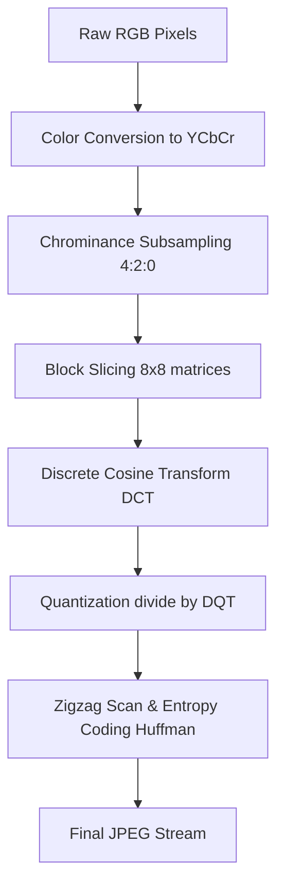

# JPEG File Format Standard: DCT Quantization & Huffman Compression

The **Joint Photographic Experts Group (JPEG)** format, standardized under **ISO/IEC 10918-1**, is the most widely compatible lossy image compression standard in the world. Often saved with `.jpg` or `.jpeg` extensions, the format uses chrominance subsampling, Discrete Cosine Transforms (DCT), quantization tables, and Huffman entropy coding to reduce photographic file sizes by up to 90% with minimal visible quality loss.

This specification document outlines the low-level **JPEG marker segment layout**, the **RGB to YCbCr color transformation formulas**, **DCT quantization mathematics**, and compression optimization guidelines.

---

## What is the JPEG File Format Specification?

The JPEG specification defines a compression algorithm for continuous-tone (photographic) images. Instead of storing individual pixel color values, JPEG converts the image data into frequency coefficients, allowing the compressor to discard details that the human eye is less sensitive to.

Key aspects of the JPEG standard include:
*   **Lossy Compression:** Quantizes high-frequency details to achieve significant file size reductions.
*   **YCbCr Color Model:** Separates brightness data from color data to take advantage of human visual limitations.
*   **Marker Segment Container:** Uses specific 2-byte marker markers (like `SOI`, `DQT`, `SOF0`, `SOS`, and `EOI`) to structure the file.

---

## JPEG Container Structure & Marker Segment Codes

A JPEG file is a binary stream structured as a sequence of **marker segments**. Every segment begins with a `0xFF` byte followed by a marker payload byte (sentinel) defining the segment type:

```
+-----------------------------------------------------------+
| SOI (Start of Image: FF D8)                               |
+-----------------------------------------------------------+
| APP0 (JFIF Header: FF E0) or APP1 (EXIF Metadata: FF E1)  |
+-----------------------------------------------------------+
| DQT (Define Quantization Table: FF DB)                    |
+-----------------------------------------------------------+
| SOF0 (Start of Frame: FF C0 - Width, Height, Bit Depth)   |
+-----------------------------------------------------------+
| DHT (Define Huffman Table: FF C4)                         |
+-----------------------------------------------------------+
| SOS (Start of Scan: FF DA - Raw Compressed Bitstream)    |
+-----------------------------------------------------------+
| EOI (End of Image: FF D9)                                 |
+-----------------------------------------------------------+
```

### Core JPEG Marker Codes
*   **`SOI` (Start of Image - `FF D8`):** A 2-byte marker that marks the beginning of the JPEG file.
*   **`APP0` (JFIF Header - `FF E0`):** Contains basic file parameters, resolution values, and thumbnail data.
*   **`APP1` (EXIF Metadata - `FF E1`):** Stores camera capture parameters, GPS location data, and orientation tags.
*   **`DQT` (Define Quantization Table - `FF DB`):** Specifies the quantization matrices used to scale the frequency coefficients.
*   **`SOF0` (Start of Frame, Baseline DCT - `FF C0`):** Defines the image height, width, bit depth (usually 8 bits per channel), and color components.
*   **`DHT` (Define Huffman Table - `FF C4`):** Lists the Huffman codes used for entropy compression.
*   **`SOS` (Start of Scan - `FF DA`):** Marks the start of the compressed pixel data stream.
*   **`EOI` (End of Image - `FF D9`):** A 2-byte marker that terminates the JPEG stream.

---

## Baseline vs. Progressive JPEG Rendering

The JPEG standard defines two primary methods for structuring and rendering image scans:

### 1. Baseline JPEG (Top-to-Bottom)
In a baseline JPEG, the image data is stored and decoded in a single top-to-bottom pass. When loading on a slow network, the image displays line-by-line from top to bottom, leaving the bottom of the image blank until the data completes.

### 2. Progressive JPEG (Blur-to-Sharp)
A progressive JPEG splits the image data into multiple **scans** (passes):
*   **Spectral Selection:** The first scan contains only the low-frequency coefficients (basic shapes and average colors). The image loads quickly as a blurry placeholder.
*   **Successive Approximation:** Subsequent scans deliver the higher frequency coefficients (adding textures and fine details), sharpening the image progressively.
*   **Web Benefits:** Progressive JPEGs provide a better user experience on slow connections because visitors see a low-resolution preview almost instantly, rather than waiting for a top-down load.

---

## The JPEG Compression Pipeline

JPEG compression uses a multi-step mathematical pipeline to convert raw pixels into a compressed bitstream:



### 1. Color Space Conversion (RGB to YCbCr)
First, the RGB pixel values are converted to the **YCbCr color space**. This separates the luminance (Y, brightness) channel from the chrominance (Cb/Cr, blue/red color difference) channels using standard mathematical formulas:
$$Y = 0.299R + 0.587G + 0.114B$$
$$C_b = -0.1687R - 0.3313G + 0.5B + 128$$
$$C_r = 0.5R - 0.4187G - 0.0813B + 128$$

### 2. Chrominance Subsampling
Because the human eye is highly sensitive to brightness details but less sensitive to color shifts, the color channels ($C_b, C_r$) are downsampled to a lower resolution. The most common mode is **4:2:0 subsampling**, which reduces color resolution by half both horizontally and vertically, saving 50% of the raw data size before compression even begins.

### 3. $8\times8$ Block Partitioning & Discrete Cosine Transform (DCT)
The image channels are divided into $8\times8$ pixel matrices. If an $8\times8$ block of pixels is represented as $f(x,y)$, it is transformed into the frequency domain ($F(u,v)$) using the **Forward 2D Discrete Cosine Transform**:
$$F(u,v) = \frac{1}{4} C(u) C(v) \sum_{x=0}^{7} \sum_{y=0}^{7} f(x,y) \cos\left[\frac{(2x+1)u\pi}{16}\right] \cos\left[\frac{(2y+1)v\pi}{16}\right]$$
This converts the pixel block into a set of frequency coefficients. The top-left value is the **DC coefficient** (representing average brightness), while the remaining 63 values are **AC coefficients** (representing horizontal and vertical color changes).

### 4. Quantization Mathematics and Quality Factors
Quantization is the lossy step in JPEG compression. The transform coefficients are divided by values in a **Quantization Table (DQT)** and rounded to the nearest integer:
$$\text{Quantized}(u,v) = \text{round}\left( \frac{F(u,v)}{\text{Table}(u,v)} \right)$$
Higher frequency coefficients (towards the bottom-right of the block) are divided by larger values, which rounds them to zero. This discards high-frequency detail that is invisible to the human eye, making the data highly compressible.

The **Quality Factor (1 to 100)** controls the scale of the Quantization Table values. The standard formula scales the values in the quantization table ($T$) based on the user's quality setting ($Q$):
*   For $Q < 50$:
    $$S = \frac{5000}{Q}$$
*   For $Q \geq 50$:
    $$S = 200 - 2Q$$
*   Scale the table entry:
    $$T_{scaled}(u,v) = \lfloor \frac{T_{base}(u,v) \times S + 50}{100} \rfloor$$
A lower quality setting ($Q$) results in a larger scaling factor ($S$) and larger table values ($T_{scaled}$), which rounds more frequency coefficients to zero, resulting in a smaller file size but lower image quality.

### 5. Zigzag Scan & Entropy Coding
The quantized coefficients are scanned in a **zigzag pattern** starting from the top-left DC coefficient. This groups the remaining non-zero low-frequency coefficients first, followed by long runs of zero values from the high-frequency coefficients. 

These runs of zeros are compressed using **Run-Length Encoding (RLE)** and then encoded using **Huffman Coding** to generate the final compressed byte stream.

---

## Disadvantages & Generation Loss of the JPEG Format

While JPEG is widely supported, it is a legacy format with several drawbacks:
*   **Generation Loss:** Because JPEG compression is lossy, every time you open, edit, and re-save a JPEG file, it goes through the quantization process again. This accumulates compression noise, leading to visible blur and color distortion (generation loss).
*   **No Transparency Support:** JPEG files cannot store alpha-channel transparency data. Any transparent areas are rendered as solid black or white backdrops.
*   **Vector Rendering Artifacts:** JPEG is optimized for photographs. It struggles with flat graphics, line art, or text, creating fuzzy compression noise (ringing artifacts) around sharp edges.

---

## Frequently Asked Questions About the JPEG Specification

### What is the difference between JPG and JPEG?
There is no technical difference between JPG and JPEG. Both extensions represent files that conform to the exact same ISO JPEG compression standard. The `.jpg` extension was created for older MS-DOS operating systems, which limited file extensions to three characters.

### How does the quantization step work?
Quantization is the lossy phase of JPEG compression. It divides the frequency coefficients of each $8\times8$ pixel block by corresponding values in a Quantization Table (DQT) and rounds the results to the nearest integer. This converts many of the high-frequency coefficients to zero, allowing the data to compress efficiently.

### What is the purpose of the YCbCr color model?
The YCbCr model separates the image brightness channel (Y) from the color channels (Cb and Cr). Since the human eye has higher spatial resolution for brightness than for color, the color channels can be downsampled (chrominance subsampling) to reduce file sizes without changing the perceived quality of the image.

### Why are there artifacts around text in JPEG files?
JPEG uses block-based frequency compression ($8\times8$ blocks). For sharp edges like text or line art, the Discrete Cosine Transform cannot represent the sudden color transitions accurately without using high frequencies. When these high frequencies are quantized (rounded to zero), it creates fuzzy noise (ringing artifacts) around the edges.

### Does the JPEG format support animations?
No, the standard JPEG specification does not support animations. To animate JPEGs, developers historically used **Motion JPEG (M-JPEG)**, which saves a sequence of JPEG frames in a video container, though this has been replaced by modern video codecs like MP4 and WebM.

### How can I convert PNG to JPG securely?
To convert PNG graphics to compatible JPEGs without uploading your files to third-party servers, use our browser-based [PNG to JPG Converter](/tools/png-to-jpg). The tool runs locally in your browser, allowing you to convert your files privately and securely.