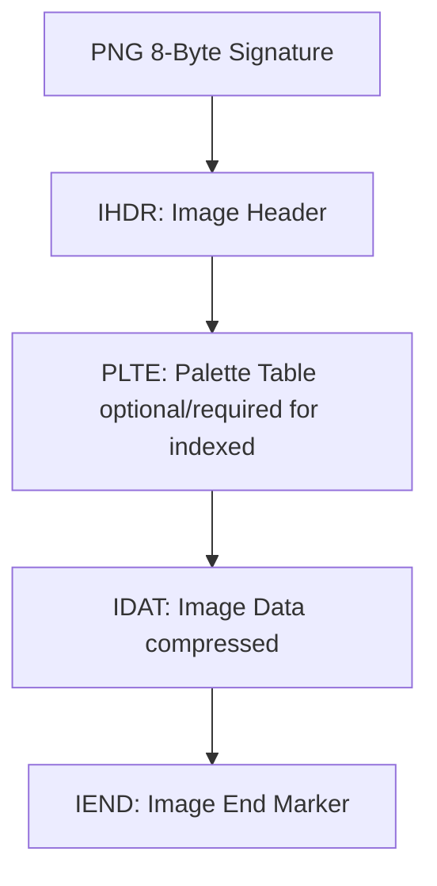
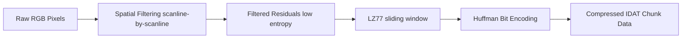

# PNG File Format Specification: Chunks, Header & Metadata Guide

The **Portable Network Graphics (PNG)** file format is an extensible, lossless raster-graphics file standard defined under the official World Wide Web Consortium (W3C) recommendation. Created in 1995 as a patent-free alternative to the Compuserve GIF format, the PNG specification defines a strict, chunk-based binary stream format that supports up to 48-bit truecolor, 16-bit grayscale, 8-bit indexed-color, and full alpha-channel transparency. 

This specification document outlines the exact binary layout, byte-level chunk types, spatial filtering systems, metadata encoding chunks, and web optimization practices for the PNG file standard.

---

## What is the PNG File Format Specification?

The PNG specification defines a byte stream format that is designed to be independent of hardware, operating systems, and network platforms. The primary goals of the standard are portability, lossless compression, and extensibility.

Unlike other raster standards, a PNG file does not exist as a single, contiguous block of pixel data. Instead, it is built from a strict sequence of modular, byte-aligned blocks known as **chunks**. This architecture allows for:
*   **Forward Compatibility:** Legacy decoders can safely skip unrecognized chunk blocks while still rendering the critical pixel payload.
*   **Metadata Flexibility:** Textual metadata, color management profiles, and transparency indices can be added via ancillary chunks without modifying the base decoder architecture.
*   **Error Detection:** Every chunk includes a self-contained 32-bit CRC code to detect data corruption during transmission or file handling.

---

## Critical Chunks of a PNG File (IHDR, PLTE, IDAT, IEND)

A valid PNG stream must begin with the standard **8-byte PNG signature** (`89 50 4E 47 0D 0A 1A 0A` in hexadecimal) followed immediately by a series of chunks. Every chunk is divided into four fields:
1.  **Length (4 bytes):** Unsigned integer defining the size of the Chunk Data payload.
2.  **Chunk Type (4 bytes):** ASCII identifier where case sensitivity acts as properties (Critical vs. Ancillary, Private vs. Public, Safe-to-copy).
3.  **Chunk Data (Variable):** Payload bytes defined by the type.
4.  **CRC (4 bytes):** Cyclic Redundancy Check (CRC-32) computed on the Type and Data fields.

To render a PNG image, a decoder requires at least three critical chunks, which must follow a strict layout order:

### 1. The `IHDR` Chunk (Image Header)
The `IHDR` chunk must be the first chunk in the file. It is exactly 13 bytes in length and contains the fundamental layout of the image:
*   **Width (4 bytes):** The width of the image in pixels.
*   **Height (4 bytes):** The height of the image in pixels.
*   **Bit Depth (1 byte):** The number of bits per sample or per palette index (supports 1, 2, 4, 8, or 16).
*   **Color Type (1 byte):** Defines color space configuration:
    *   `0`: Grayscale (supports bit depths 1, 2, 4, 8, 16)
    *   `2`: Truecolor/RGB (supports bit depths 8, 16)
    *   `3`: Indexed-color/Palette (supports bit depths 1, 2, 4, 8)
    *   `4`: Grayscale with Alpha channel (supports bit depths 8, 16)
    *   `6`: Truecolor with Alpha channel/RGBA (supports bit depths 8, 16)
*   **Compression Method (1 byte):** Always `0` (indicating DEFLATE compression).
*   **Filter Method (1 byte):** Always `0` (indicating adaptive spatial filtering).
*   **Interlace Method (1 byte):** `0` (no interlace) or `1` (Adam7 progressive interlace).

### 2. The `PLTE` Chunk (Palette Table)
The `PLTE` chunk is required for indexed-color images (color type 3) and optional for truecolor images (color types 2 and 6). It contains a list of 1 to 256 palette entries, with each entry consisting of a 3-byte RGB value (`Red`, `Green`, `Blue`). The chunk data length must be a multiple of 3.

### 3. The `IDAT` Chunk (Image Data)
The `IDAT` chunk contains the actual pixel data, filtered and compressed via DEFLATE. A single PNG file can contain multiple sequential `IDAT` chunks. This split allows encoders to output compressed blocks progressively without holding the entire compressed file in memory.

### 4. The `IEND` Chunk (Image End)
The `IEND` chunk marks the end of the PNG stream. It must be the final chunk in the file and has a Data length of `0` bytes.

---

## Ancillary Chunks & Metadata Storage (tEXt, zTXt, iTXt, eXIf)

Ancillary chunks are optional metadata blocks. They provide auxiliary information about the image, such as color management, transparency values, and creator metadata, which the decoder can ignore if it only needs to render pixels.

### 1. Textual Metadata Chunks
PNG supports three chunks for storing text-based metadata (such as copyright, author names, descriptions, or software tags):
*   **`tEXt`:** Stores uncompressed ISO/IEC 8859-1 (Latin-1) characters. It consists of a text keyword (e.g., `Author`), a null separator byte (`00`), and the text value.
*   **`zTXt`:** Similar to `tEXt`, but compresses the text value using DEFLATE, making it ideal for storing large chunks of text or descriptions.
*   **`iTXt`:** A modern extension that supports UTF-8 international text. It can be uncompressed or compressed and includes language tags.

### 2. The `eXIf` Chunk (EXIF Metadata)
Introduced as an official extension in 2017, the `eXIf` chunk standardizes the storage of standard exchangeable image file format metadata (EXIF) inside PNG. Previously, metadata from camera captures (such as aperture, exposure times, GPS location, and camera model) had to be wrapped inside custom XML profiles. The `eXIf` chunk contains raw EXIF metadata bytes directly, allowing graphic editors to preserve photography metadata.

### 3. Other Core Ancillary Chunks
*   **`tRNS` (Transparency):** Allows indexed images to define transparency indices, or truecolor images to define a single "key" color that should be rendered as fully transparent.
*   **`gAMA` (Gamma Correction):** Specifies the relationship between the image samples and desired display brightness.
*   **`sRGB` (Standard RGB Color Space):** Tells the decoder that the image colors conform to the standard sRGB color space.
*   **`iCCP` (ICC Profile):** Embeds an ICC color profile for exact color matching across professional monitors and printing devices.

---

## The PNG Spatial Filtering Math & DEFLATE Compression

Before a PNG file is compressed, it goes through **spatial filtering**. This step prepares the pixel grid to make it easier for DEFLATE to compress, which is why PNG compression is lossless.

### 1. Spatial Filtering Formulas
A PNG filter is applied to a single byte of scanline data. The filter predicts the value of the byte based on previous bytes and records only the difference (residual). There are 5 filter algorithms:

*   **None (Filter Type 0):**
    $$\text{Filter}(x) = x$$
*   **Sub (Filter Type 1):** Predicts based on the byte immediately to the left ($a$):
    $$\text{Filter}(x) = x - a \pmod{256}$$
*   **Up (Filter Type 2):** Predicts based on the byte directly above ($b$):
    $$\text{Filter}(x) = x - b \pmod{256}$$
*   **Average (Filter Type 3):** Predicts based on the mathematical average of left ($a$) and above ($b$):
    $$\text{Filter}(x) = x - \lfloor \frac{a + b}{2} \rfloor \pmod{256}$$
*   **Paeth (Filter Type 4):** Predicts based on a linear function of left ($a$), above ($b$), and upper-left ($c$):
    $$p = a + b - c$$
    The filter finds the predictor ($a, b,$ or $c$) that is closest to $p$ and subtracts it from $x$.

By calculating these difference residuals, the scanline data becomes highly redundant (mostly zeros and small offsets), which maximizes the compression ratio of the next stage.

### 2. DEFLATE Compression
The filtered residuals are compressed using **DEFLATE**, which is the standard algorithm used in ZIP archives. It has two compression passes:
1.  **LZ77:** Matches duplicate byte sequences and replaces them with pointers (length/distance) pointing back to the previous sequence in a sliding window buffer.
2.  **Huffman Coding:** Replaces the byte codes with variable-length bit sequences based on frequency (more common bytes get shorter codes, saving space).

---

## PNG Color Types and Bit Depth Specifications

The PNG standard is highly versatile, supporting multiple color spaces and depths to fit different use cases:

| Color Type | Name | Bit Depths | Description |
| :--- | :--- | :--- | :--- |
| **`0`** | Grayscale | 1, 2, 4, 8, 16 | Each pixel is a single grayscale sample. At 1-bit depth, this represents pure black and white. |
| **`2`** | Truecolor / RGB | 8, 16 | Each pixel is an RGB triplet (Red, Green, Blue). Supports up to 48-bit color depth. |
| **`3`** | Indexed-color | 1, 2, 4, 8 | Pixels are index pointers into a palette (up to 256 colors). Greatly reduces file size for simple graphics. |
| **`4`** | Grayscale with Alpha | 8, 16 | Each pixel consists of a grayscale sample and an alpha opacity sample. |
| **`6`** | Truecolor with Alpha | 8, 16 | Each pixel is an RGBA quadruplet (Red, Green, Blue, Alpha). Supports full transparent gradients. |

---

## SEO Best Practices for Naming and Compressing PNG Files

While the PNG format preserves high-quality graphics, it can result in large file sizes. Use these best practices to optimize PNGs for search engines:

1.  **Use Descriptive, Keyword-Rich Filenames:** Search crawlers read filenames to understand image context. Use hyphens as delimiters and include keywords (e.g., `vector-logo-transparent.png` instead of `untitled-1.png`).
2.  **Strip Metadata for the Web:** Camera-generated EXIF and graphic creator metadata (like Photoshop history markers) add unnecessary payload weight. Use our client-side [Image Compressor](/tools/image-compressor) to strip ancillary metadata chunks and reduce file size without losing pixel quality.
3.  **Opt for PNG-8 for Simple UI Graphics:** If an image contains fewer than 256 colors (such as a logo, vector chart, or simple interface element), save it as **PNG-8 (Indexed)** rather than **PNG-24 (RGBA)**. This can reduce file sizes by up to 70%.

---

## Frequently Asked Questions About the PNG Specification

### What is the 8-byte signature of a PNG file?
Every PNG stream begins with the hexadecimal byte sequence `89 50 4E 47 0D 0A 1A 0A`. This signature is used to confirm the file type, detect 7-bit vs. 8-bit transfer corruption, test line ending translations, and prevent MS-DOS print output crashes.

### What is the difference between a critical chunk and an ancillary chunk?
*   **Critical chunks** (`IHDR`, `PLTE`, `IDAT`, `IEND`) contain the essential data needed to read and display the image. A decoder will fail to render the file if any critical chunk is missing or corrupted.
*   **Ancillary chunks** (`tEXt`, `eXIf`, `gAMA`, etc.) store non-essential metadata. Decoders can safely ignore them while still successfully displaying the image.

### How does PNG achieve lossless compression?
PNG uses a two-step process: scanline spatial filtering followed by DEFLATE compression. Spatial filtering replaces pixel color values with difference values relative to neighboring pixels. These difference values are highly repetitive and compress efficiently using LZ77 and Huffman coding without discarding any image data.

### Does the PNG standard support animation?
No, the standard W3C PNG specification does not support animations. To animate PNGs, developers use **APNG (Animated Portable Network Graphics)**, which extends the PNG standard by adding animation frame chunks (`acTL`, `fcTL`, `fdAT`) while remaining backward-compatible with older, static PNG decoders.

### What is the maximum image dimensions supported by PNG?
The PNG specification limits image dimensions to $2^{31}-1$ pixels in width and height (over 2 billion pixels). In practice, file dimensions are limited by available system memory and the limits of the software decoding the image.

### Why should I strip EXIF metadata from PNGs for web publishing?
Metadata (like EXIF geotags or software tags) is saved in optional ancillary chunks. For web publishing, this metadata adds unnecessary file size, which slows down page load speed and hurts your site's Core Web Vitals score. Stripping these chunks reduces the file size without changing the visual quality of the image.