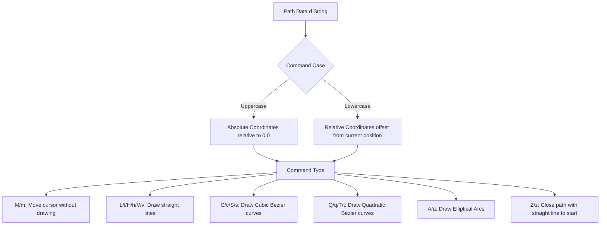

# SVG File Format Standard: Scalable Vector Graphics XML Specification

The **Scalable Vector Graphics (SVG)** format is an XML-based vector graphics standard developed and governed by the World Wide Web Consortium (W3C). First released in 2001, SVG represents geometric shapes, paths, text, and filter effects as structured XML nodes. 

This specification document outlines the low-level **XML tag hierarchy**, the **path data grammar (`d` attribute command set)**, **viewBox coordinate mapping formulas**, and performance optimization guidelines.

---

## What is the SVG File Format Specification?

Unlike raster graphics formats (such as JPEG or PNG) that represent images as grids of individual colored pixels, the SVG specification defines images using **mathematical geometry**. An SVG file consists of instructions describing how to draw lines, curves, circles, and polygons.

Key properties of the SVG standard include:
*   **Infinite Scalability:** Images can be scaled up or down to any resolution without pixelation, loss of detail, or file size increases.
*   **DOM Integration:** Because SVG is written in XML, it is parsed directly into the browser's Document Object Model (DOM). This allows developers to style vector elements using CSS and animate them using JavaScript.
*   **Accessibility (A11y):** Text inside SVG files remains readable text rather than rasterized shapes, making it searchable by search engines and screen readers.

---

## Scalable Vector Graphics XML Node Structure

At the binary level, a static SVG file is a plain-text XML document. It begins with the standard XML declaration and the root `<svg>` tag:

```xml
<?xml version="1.0" encoding="utf-8"?>
<svg xmlns="http://www.w3.org/2000/svg" viewBox="0 0 100 100" width="100" height="100">
  <!-- Geometric element nodes go here -->
</svg>
```

### Core XML Nodes in SVG
*   **`<svg>`:** The root element that defines the viewport, coordinate system, and XML namespaces. The `xmlns` attribute is required to tell the browser's parser to interpret the nodes as SVG elements.
*   **`<rect>`:** Renders rectangles and squares. Attributes include `x`, `y` (top-left coordinates), `width`, `height`, and optional rounded corner parameters `rx` and `ry`.
*   **`<circle>`:** Renders circles based on a center point `cx`, `cy`, and a radius `r`.
*   **`<line>`:** Draws straight lines between two points defined by coordinates `x1`, `y1` and `x2`, `y2`.
*   **`<polyline>`:** Connects multiple points with straight lines, defined by a space-separated list of coordinate pairs in the `points` attribute.
*   **`<polygon>`:** Draws closed shapes by connecting multiple points, similar to a polyline, but automatically connects the final point back to the starting point.
*   **`<text>`:** Renders standard text inside the graphic, supporting attributes like `font-family`, `font-size`, and coordinate placements.

---

## Path Data Command Grammar (`d` Attribute)

The `<path>` element is the most versatile shape in the SVG standard. It can draw complex curves, freehand paths, and detailed silhouettes using a compact coordinate language stored in the **`d` (data) attribute**.

The `d` attribute contains a string of letters (commands) and numbers (coordinates). **Uppercase commands** use absolute coordinates, while **lowercase commands** use relative coordinates:



### Core Path Commands
*   **`M` / `m` (Move to):** Moves the drawing cursor to a new coordinate pair without drawing a line. Every path must begin with a Move command.
*   **`L` / `l` (Line to):** Draws a straight line from the current cursor position to the specified coordinates.
*   **`H` / `h` & `V` / `v` (Horizontal & Vertical Line to):** Draws horizontal or vertical lines to a single coordinate, saving file size.
*   **`C` / `c` (Cubic Bézier Curve):** Draws a smooth curve using two control points to define the curvature:
    $$\text{Command Syntax: } C \ x1 \ y1, \ x2 \ y2, \ x \ y$$
*   **`S` / `s` (Smooth Cubic Bézier):** Draws a curve using a single control point, automatically reflecting the control point of the previous curve to ensure smooth transitions.
*   **`Q` / `q` (Quadratic Bézier Curve):** Draws a curve using a single control point shared by both endpoints.
*   **`A` / `a` (Elliptical Arc):** Draws a curve based on a segment of an ellipse. It requires parameters for horizontal/vertical radii, axis rotation, flags for large/sweep arcs, and final target coordinates.
*   **`Z` / `z` (Close Path):** Draws a straight line from the current cursor position back to the starting point of the current path segment.

---

## Coordinate Geometry & Viewbox Mapping Formulas

To render an SVG correctly, the browser must map the internal coordinate system of the graphic onto the actual screen pixels. This is defined by the relationship between the **Viewport** and the **`viewBox`**.

### 1. Viewport vs. viewBox
*   **Viewport:** The actual display area of the SVG on the web page, defined by the `width` and `height` attributes (e.g., `width="500px" height="300px"`).
*   **`viewBox`:** The internal coordinate grid of the graphic, defined by four values:
    $$\text{viewBox} = [x_{min}, \ y_{min}, \ w_{internal}, \ h_{internal}]$$

### 2. ViewBox Transformation Math
When the viewport aspect ratio does not match the viewBox aspect ratio, the browser scales the graphic based on the `preserveAspectRatio` attribute (which defaults to `xMidYMid meet`). 

The scaling factor ($s$) is calculated as:
$$s_x = \frac{w_{viewport}}{w_{internal}}, \quad s_y = \frac{h_{viewport}}{h_{internal}}$$
$$\text{Scale } (s) = \min(s_x, s_y)$$

This scaling math ensures that the vector graphic scales smoothly to fit any screen resolution without stretching or distorting.

---

## Styling, Grouping, and Definition Blocks

The SVG standard supports grouping and reuse features that keep file sizes small and make styling easier.

### 1. Grouping with the `<g>` Tag
The `<g>` tag groups multiple elements together. This allows you to apply styles (like colors, stroke weights, or CSS classes) or coordinate transforms (like rotation or scaling) to the entire group at once, keeping your code clean.

### 2. Definitions and Reuse (`<defs>` and `<use>`)
The `<defs>` element is a storage block for components that you want to reuse later (such as gradients, templates, symbols, or paths). These elements are not rendered directly on the page. 

To display a defined element, reference its ID using the `<use>` tag:
```xml
<use href="#shared-icon" x="20" y="50" />
```
This reuse system avoids duplicate shapes, reducing file sizes for complex layouts.

---

## Vector vs. Raster Graphics: Comparison Matrix

Understanding the differences between vector and raster formats helps you choose the right one for your assets:

| Feature | SVG (Vector) | PNG / JPEG (Raster) |
| :--- | :--- | :--- |
| **Data Representation** | Mathematical paths and shapes | Grid of individual color pixels |
| **Scalability** | **Infinite (No quality loss)** | Finite (Becomes blurry when enlarged) |
| **Ideal Use Cases** | **Logos, icons, charts, line art** | Photographs, complex gradients, mockups |
| **Interactivity** | **Yes (Fully accessible via DOM/CSS)** | No (Static pixel data) |
| **Avg. File Size** | Small (Determined by shape complexity) | Large (Determined by resolution/pixel count) |
| **Text Searchable** | **Yes (Indexed by search engines)** | No (Text is rasterized into pixels) |

---

## Frequently Asked Questions About the SVG Specification

### What is an SVG file?
An SVG (Scalable Vector Graphics) file is a plain-text XML document that describes two-dimensional vector graphics using geometric shapes, paths, and text. Because it is mathematical, SVG scales to any resolution without losing quality.

### What is the purpose of the viewBox attribute?
The `viewBox` attribute defines the internal coordinate system and aspect ratio of the SVG graphic. It tells the browser's renderer how to map the internal coordinates of your vector shapes onto the actual width and height of the display container on a web page.

### How does the SVG path `d` command work?
The `d` attribute of a `<path>` element contains drawing instructions. It uses commands like `M` to move the cursor, `L` to draw straight lines, and `C` to draw Bézier curves. Using uppercase commands calculates absolute coordinates, while lowercase commands use relative coordinates from the cursor's current position.

### Can SVGs contain raster images?
Yes. The SVG standard allows you to embed raster images (like JPEG or PNG) inside a vector graphic using the `<image>` tag. However, the embedded raster portion will not scale infinitely and will pixelate if enlarged.

### Are SVGs indexed by search engines?
Yes. Because SVG is written in plain XML text, search engines (like Google and Bing) can read, index, and crawl the text contents, links, and keywords inside the file. This makes SVG a great choice for logos and graphics with text.

### How can I convert SVG to PNG?
While SVG is ideal for web scalability, some design software or social platforms require standard raster files. To convert SVG files to PNG locally without uploading them to an external server, use our browser-based [SVG to PNG Converter](/tools/svg-to-png).